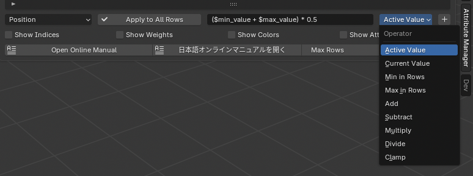
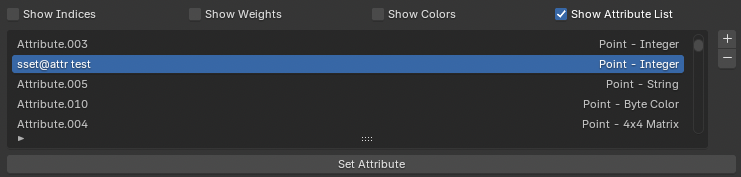

---
# Feel free to add content and custom Front Matter to this file.
# To modify the layout, see https://jekyllrb.com/docs/themes/#overriding-theme-defaults

layout: default
permalink: /AttributeManager/index.html
---

# Attribute Manager for Blender

- <a href="/AttributeManager/index_J.html">日本語ドキュメント</a>

## About

The Attribute Manager is a Blender add-on that provides a spreadsheet-style interface for editing mesh vertex, edge, and face attributes, as well as various other object attributes.

It offers a convenient GUI for bulk attribute editing that would otherwise require manual and tedious panel clicks. 

## Blender Version

This add-on works with: 
- Blender 4.0, 5.0 or later
- It is written entirely in Python and works on macOS and Windows.

## Installation

- Open Blender.
- Go to Edit > Preferences > Add-ons.
- Click Install… and select the AttributeManager.zip.
- Enable the add-on by checking the box next to Attribute Manager.

 

## How to Use

You can adjust the width of the panel by dragging its left edge.
The number of visible table rows can be changed using <b>Max Rows</b> (default is 6). 

 

## User Interface Overview

 

### <ins>(1) Correct Selected (Correct Objects)</ins> 

Pressing Correct Selected loads the currently selected vertices, edges, faces, or objects into the Attribute Manager.
- In Mesh Edit Mode, it loads the selected mesh elements (vertex/edge/face) into the spreadsheet for editing.
- In Object Mode, it loads attributes of the selected objects.
- If you change selection or the mesh structure, press Correct Selected again to refresh the table. 

### <ins>(2) Mode Selection</ins> 
There are four editing modes: 
- Vertex
- Edge
- Face
- Face Corner
- Object

When switching modes, the currently selected elements are automatically reloaded into the table.
Vertex/Edge/Face modes operate in Edit Mode, while Object mode operates in Object Mode.

### <ins>(3) Attribute Selection</ins> 
This area lets you select which attributes to display using toggle buttons.
Only selected attributes appear as columns in the editing table.
Use this to focus on only the fields you need.

### <ins>(4) Editing Table</ins> 
This is the spreadsheet-style table where loaded attributes can be edited.
- Use the vertical scroll bar on the right to scroll through rows.
- The first row shows the attribute names (column headers).
- In Vertex/Edge/Face modes, mesh element indices are shown.
- In Object mode, object names are shown.
- The currently active row is highlighted in blue.
- When you select a row, the element in that row will be set as the active element.

 

### <ins>(5) Apply to All Rows</ins> 
Use this button when you want to apply a specific column's value (item) to all rows based on an expression.

- Enter the formula in the expression field.
- Select the target column from the drop-down menu.
- Press "Apply to All Rows."

The value of the specified float field will be calculated and applied to the same item in all rows based on the arithmetic formula. If you press "Apply to All Rows" for an item other than a float, the value of the currently selected active cell will be applied to all rows.  

Expression are based on Python's eval function and support all four basic arithmetic operations. The following variables are available for Attribute List expressions.  
You can also use Python's <a href="https://docs.python.org/3/library/math.html">math module</a>.  

- $active: The value of the specified item (cell) in the currently selected row.
- $value: The value of the specified item (cell) in the row being calculated.
- $min_value: The minimum value of the specified item (cell) in all rows.
- $max_value: The maximum value of the specified item (cell) in all rows.

You can add the above variables and basic operators to the field using the pop-up to the right of the input field.  

Example 1: Set all row values ​​to the value of the currently selected cell. 
<b>$active</b> 

Example 2: Add 2.0 to all row values. (If you are performing arithmetic on the current values, you can omit the first $value.) 
<b>$value + 2.0</b> or <b>+ 2.0</b> 

Example 3: Set all row values ​​to the minimum value of all rows. 
<b>$min_value</b> 

Example 4: Set all row values ​​to the midpoint between the minimum and maximum values ​​of all rows. 
<b>($min_value + $max_value) / 2.0</b> 

Example 5: Limit row values ​​to a specified range (0.0 - 1.0). 
<b>clamp($value, 0.0, 1.0)</b> 

Example 6: Set the square root of each value in all rows. 
<b>math.sqrt($value)</b> 

Example 7: Convert 10.0° to radians and add it to each value in all rows. 
<b>+ math.radians(10.0)</b> 

 

 

### <ins>(6) Show Indices, Show Weights, Show Colors, Show Attribute List</ins> 

- <b>Show Indices</b> displays the index numbers of mesh elements in the 3D View.
This performs the same function as the Indices toggle in the Blender Edit Mode overlay.

- <b>Show Weights</b> displays vertex group weights as a gradient in the 3D View.
This matches the <b>Vertex Group Weights</b> overlay setting in Edit Mode.

When switching 3D views, you must reset the Show Indices and Show Weights settings. 

 

- Show Colors 
→ Displays weights as a gradient in the 3D view.
→ Same function as Object Color in "Viewport Shading" in Object Mode.

- Show Attribute List 
→ Displays a list of editable attributes in Edit Mode.
→ This list functions the same as the attribute list in Blender's standard Attribute tab.

When switching 3D views, you must reset the Show Colors settings. 

 

### <ins>(7) Max Rows<ins> 
<b>Max Rows</b> sets the number of rows shown in the editing table.
Default value: 6.

### <ins>(8) Attribute List</ins> 
The Attribute List displays a list of attributes that can be edited in Edit Mode. Pressing the <b>Set Attribute</b> button sets the selected attribute to the editing table.
You can also add a user-defined attribute by pressing the + button to the right of the Attribute List. Pressing the - button deletes the currently selected attribute.

 

## Vertex Edit Mode

 

In Vertex Edit Mode, you can edit:
- Vertex coordinates
- Shape keys
- Vertex group weights
- Crease
- Bevel Weight
- Color Attribute (POINT)
- Other attributes (Float, Float Vector, Int, String, Bool)

Coordinate values can be displayed and edited in either local or global coordinate space. 
When in Edit Mode, global coordinates are converted from local, displayed in the table, and converted back when applied.
This allows precise positioning in global space when needed. 

Other attributes allow you to edit user-defined custom attributes added using the Attribute List. Select an attribute from the list of attributes set for the vertex and edit it.  

 

When Shape Key mode is set to Relative, coordinate values ​​are displayed relative to the Base key. 

 

## Edge Edit Mode

In Edge Edit Mode, you can edit edge attributes such as:
- Smooth
- Freestyle
- Crease
- Edge Bevel Weight
- Length
- Other Attributes (Float, Float Vector, Int, String, Bool)

These influence subdivision surfaces, shading, and modeling workflows. 

Other attributes allow you to edit user-defined custom attributes added using the Attribute List, etc. Select from the list of attributes set for the edge to edit.  

 

## Face Edit Mode

In Face Edit Mode, you can edit face attributes such as:
- Material slots
- Freestyle mark
- Other attributes (Float, Float Vector, Int, String, Bool)

Bulk editing is useful when many faces share the same material. Freestyle attributes can also be changed.  
Other attributes allow you to edit user-defined custom attributes added using the Attribute List, etc. Select from the list of attributes set for the face and edit.  

## Face Corner Edit Mode

You can edit attributes associated with each corner of a face:

- UV
- Color Attributes (CORNER)
- Other Attributes (Float, Float Vector, Int, String, Bool)

In Blender, UV and color attributes are stored at each corner of a face, allowing you to edit them individually or separate them to have independent values.  

Index Order specifies whether the table is displayed based on vertex or face numbers. Specifying <b>Face - Vertex</b> displays faces and their vertices in order. Specifying <b>Vertex - Face</b> displays vertices and their linked faces in order.  

When <b>Shared Vertex</b> is enabled, values ​​for the same face corner at the same vertex are edited simultaneously. Cells with the same value are not displayed. When <b>Shared Vertex</b> is turned off, values ​​for each face corner can be edited independently.  

Other attributes allow you to edit user-defined custom attributes added using the Attribute List, etc. Select from the list of attributes set for face corners and edit them.  

 

## Object Edit Mode

In Object Mode, you can edit various object attributes, including:
- Display properties
- Transform
- Relations
- Visibility
- Viewport Display
- Object-type specific attributes
- Currently the following objects are supported editing type-specific attributes for:
  - Mesh Object
  - Light Object
  - Camera Object
  - Empty Object
  - Modifier

When in Object Mode:
- Use the first dropdown to select which object types to load (e.g., Mesh, Light, Camera).
- Use the second dropdown to select the category of attributes to show.

For example, you can group attributes into categories like Transform, Relations, Visibility, etc. 
Press Apply to All Rows to apply changes to all selected objects. 
When applying the same Name to multiple objects, Blender automatically appends numbers to ensure unique names. 

In Modifier mode, you can edit the display attributes of modifiers added to objects. The editing table can be switched between displaying the order of modifiers added to each object or the order of the objects to which each modifier is added.  
Also, if you set the item to <b>Properties</b> and execute <b>Apply to All Rows</b>, all properties of the modifier in the selected row will be copied to modifiers of the same type as the modifier in the selected row. This is useful when you want to set the same properties for all modifiers at once. Enabling <b>Auto Expand</b> will expand the properties panel for the modifier in the selected row and close all other panels.  

## Change Log

### v1.0 Initial Release

- Initial release of Attribute Manager for Blender

### v1.1 New Features

- Added Face Corner Mode
- Added Color Attribute
- Added Show Colors button
- Added the ability to edit relative coordinates in Shape Keys

### v1.2 New Features Added

- Added Modifier submode to Object mode
- Fixed a bug in the Transform Rotation setting

### v1.3 New Features Added

- Added Attribute List
- Changed Apply to All Rows to use an arithmetic expression

## License

This Blender add-on is licensed under the GNU General Public License v3.0 or later.

You are free to use, modify, and redistribute it under the terms of the GPL license.
For details, please see the included `LICENSE.txt`.
