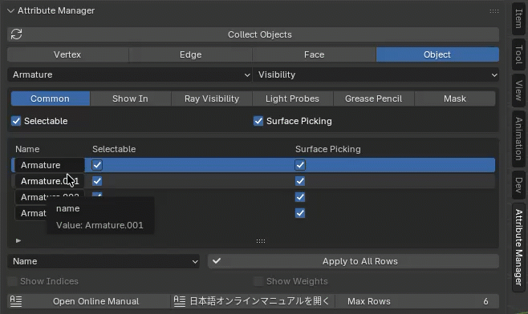

---
# Feel free to add content and custom Front Matter to this file.
# To modify the layout, see https://jekyllrb.com/docs/themes/#overriding-theme-defaults

layout: default
permalink: /AttributeManager/index.html
---

# Attribute Manager for Blender

The Attribute Manager is a Blender add-on that provides a spreadsheet-style interface for editing mesh vertex, edge, and face attributes, as well as various other object attributes.

It offers a convenient GUI for bulk attribute editing that would otherwise require manual and tedious panel clicks. 

## Blender Version

This add-on works with: 
- Blender 4.0, 5.0 or later
- It is written entirely in Python and works on macOS and Windows.

## Installation

- Open Blender.
- Go to Edit > Preferences > Add-ons.
- Click Install… and select the AttributeManager.zip.
- Enable the add-on by checking the box next to Attribute Manager.

 

## How to Use

You can adjust the width of the panel by dragging its left edge.
The number of visible table rows can be changed using <b>Max Rows</b> (default is 6). 

 

## User Interface Overview

 

### <ins>(1) Correct Selected (Correct Objects)</ins> 

Pressing Correct Selected loads the currently selected vertices, edges, faces, or objects into the Attribute Manager.
- In Mesh Edit Mode, it loads the selected mesh elements (vertex/edge/face) into the spreadsheet for editing.
- In Object Mode, it loads attributes of the selected objects.
- If you change selection or the mesh structure, press Correct Selected again to refresh the table. 

### <ins>(2) Mode Selection</ins> 
There are four editing modes: 
- Vertex
- Edge
- Face
- Object

When switching modes, the currently selected elements are automatically reloaded into the table.
Vertex/Edge/Face modes operate in Edit Mode, while Object mode operates in Object Mode.

### <ins>(3) Attribute Selection</ins> 
This area lets you select which attributes to display using toggle buttons.
Only selected attributes appear as columns in the editing table.
Use this to focus on only the fields you need.

### <ins>(4) Editing Table</ins> 
This is the spreadsheet-style table where loaded attributes can be edited.
- Use the vertical scroll bar on the right to scroll through rows.
- The first row shows the attribute names (column headers).
- In Vertex/Edge/Face modes, mesh element indices are shown.
- In Object mode, object names are shown.
- The currently active row is highlighted in blue.

### <ins>(5) Apply to All Rows<ins> 
The <b>Apply to All Rows</b> button applies the value from the selected row to all other rows for the field chosen in the adjacent dropdown.

### <ins>(6) Show Indices, Show Weights<ins> 
- <b>Show Indices</b> displays the index numbers of mesh elements in the 3D View.
This performs the same function as the Indices toggle in the Blender Edit Mode overlay.
- <b>Show Weights</b> displays vertex group weights as a gradient in the 3D View.
This matches the <b>Vertex Group Weights</b> overlay setting in Edit Mode.

### <ins>(7) Max Rows<ins> 
<b>Max Rows</b> sets the number of rows shown in the editing table.
Default value: 6.

## Vertex Edit Mode

 

In Vertex Edit Mode, you can edit:
- Vertex coordinates
- Shape keys
- Vertex group weights

Coordinate values can be displayed and edited in either local or global coordinate space. 
When in Edit Mode, global coordinates are converted from local, displayed in the table, and converted back when applied.
This allows precise positioning in global space when needed.

 

## Edge Edit Mode

In Edge Edit Mode, you can edit edge attributes such as:
- Smooth
- Crease

These influence subdivision surfaces, shading, and modeling workflows.

 

## Face Edit Mode

In Face Edit Mode, you can edit face attributes such as:
- Material slots
- Freestyle attributes

This allows quick assignment or bulk editing of material indices and rendering attributes.

## Object Edit Mode

In Object Mode, you can edit various object attributes, including:
- Display properties
- Transform values
- Object-type specific attributes

When in Object Mode:
- Use the first dropdown to select which object types to load (e.g., Mesh, Light, Camera).
- Use the second dropdown to select the category of attributes to show.

For example, you can group attributes into categories like Visibility, Transform, Display, etc. 
Press Apply to All Rows to apply changes to all selected objects. 
When applying the same Name to multiple objects, Blender automatically appends numbers to ensure unique names (e.g., “Bone_LeftLeg_001”, “Bone_LeftLeg_002”, etc.).

## Change Log

### v1.0

- Initial release of Attribute Manager for Blender

## License

This Blender add-on is licensed under the GNU General Public License v3.0 or later.

You are free to use, modify, and redistribute it under the terms of the GPL license.
For details, please see the included `LICENSE.txt`.
