---
# Feel free to add content and custom Front Matter to this file.
# To modify the layout, see https://jekyllrb.com/docs/themes/#overriding-theme-defaults

layout: default
permalink: /AttributeManager/index_J.html
---

# Attribute Manager for Blender

- <a href="/AttributeManager/index.html">English document</a>

# 概要

Attribute Manager は Blender のための強力なアドオンで、スプレッドシート形式で属性を一括編集するUIを提供します。Blenderのプロパティパネルをひとつひとつクリックして変更する代わりに、このアドオンを使うと効率的に属性値を確認・編集できます。 

## Blenderバージョン

- 4.0, 5.0以上、もしくはその派生バージョン
- アドオンはPythonのみで記述されており、macOS, Windowで動作します。

## インストール

- Blender を起動します
- メニューから Edit > Preferences を開きます
- 左側の Add-ons を選択します
- Instal from Disk をクリックして AttributeManager.zip を選択します
- Attribute Manager のチェックボックスをオンにして有効にします

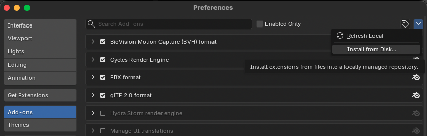
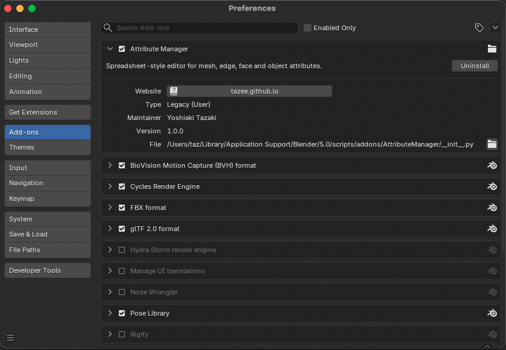

 

## 基本的な使い方

Attribute Manager は 3Dビューのサイドバー（Nパネル） に表示されます。<b>AttributeManager</b>のパネルは水平方向に伸縮可能で、パネル左側のエッジをドラッグすることでパネルの幅を調整することができます。
また、テーブルに表示する行数は<b>Max Rows</b>の値で調整できます。デフォルトは6行です。 

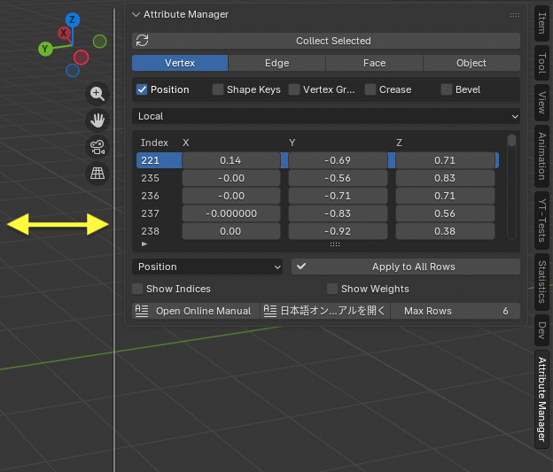

 

## メインUIの構成

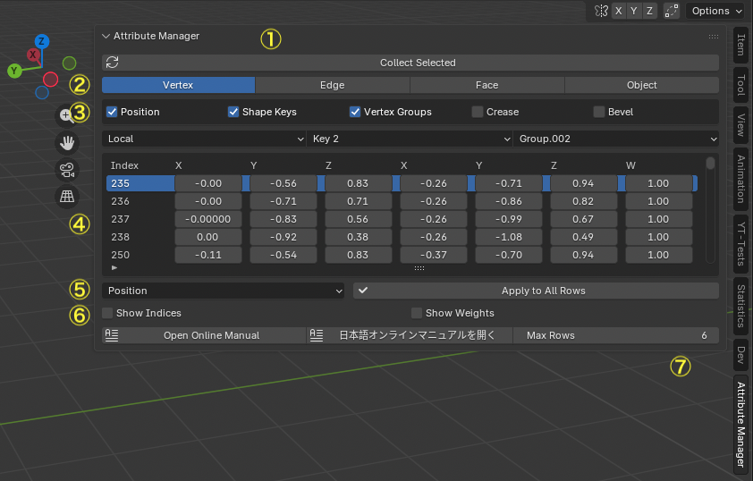

 

### <ins>(1) Correct Selected (Correct Objects)</ins> 

<b>Correct Selected</b>を押すと、現在の選択オブジェクトや選択メッシュ要素をAttribute Manager に読み込みます。

- Edit Mode では選択中の頂点／エッジ／フェイスが対象
- Object Mode では選択中のオブジェクトが対象
- 変更したい対象を選択した後に押してください 

### <ins>(2) モード選択</ins> 
編集対象を切り替えるためのモードが用意されています：

- Vertex（頂点）
- Edge（エッジ）
- Face（面）
- Face Corner（面コーナー）
- Object（オブジェクト）

この切り替えに応じて、読み込む対象・表示する属性が変わります。

### <ins>(3) 属性選択</ins> 
テーブルに表示したい属性をトグルで選択します。
チェックした属性のみがテーブルの列として表示されます。 

例： 

- Vertex モードなら「座標」「ウェイト」「Shape Key」など
- Edge モードなら「smooth」「crease」など
- Face モードなら「マテリアル」「Freestyle」など
- Face Coner モードなら「UV」「カラー」など
- Object モードなら「表示設定」「変形」「タイプ別属性」など

### <ins>(4) 編集テーブル</ins> 
これはメインの編集領域です： 

- 選択した属性を列として表示します
- 行は対象の要素（頂点/エッジ/フェイス/オブジェクト）です
- テーブルはスクロール可能です
- 最初の行は項目名（見出し）です
- 現在の行は青くハイライトされます
- 行を選択するとその行のエレメントはアクティブエレメントに設定されます。
- セルを直接編集すると、その値が即座に Blender に反映されます。

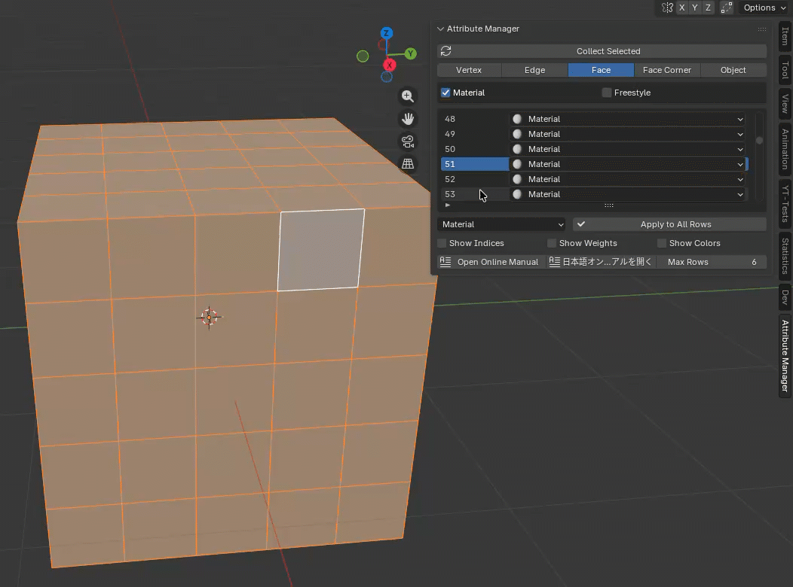

 

### <ins>(5) Apply to All Rows<ins> 
このボタンは、特定の列だけ値をすべての行に反映させたいときに使います。

- まず1行を選択する
- 適用したい値に編集する
- ドロップダウンから対象列を選ぶ
- 「Apply to All Rows」を押す

これで同じ列の値がすべての行に反映されます。

### <ins>(6) Show Indices, Show Weights, Show Colors<ins> 

- Show Indices 
→ 3Dビューに要素番号（Index）を番号付きで表示します
→ Blender の Edit Mode Overlay の「Indices」に相当します。

- Show Weights 
→ 3Dビューにウェイトをグラデーションで表示します
→ Edit Mode の「Vertex Group Weights」Overlay に相当します。

3Dビューを切り替えた時は、Show Indices, Show Weightsを再設定する必要があります。 

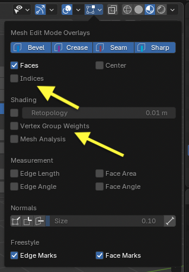

 

- Show Colors 
→ 3Dビューにウェイトをグラデーションで表示します
→ Object Mode の「Viewport Shading」にあるObject Color と同じ機能

3Dビューを切り替えた時は、Show Colorsを再設定する必要があります。 

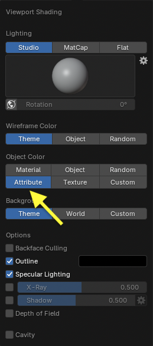

 

### <ins>(7) Max Rows<ins> 
スプレッドシート表示における一度に表示する最大行数を調整します。初期値は6行です。

## 頂点編集モード

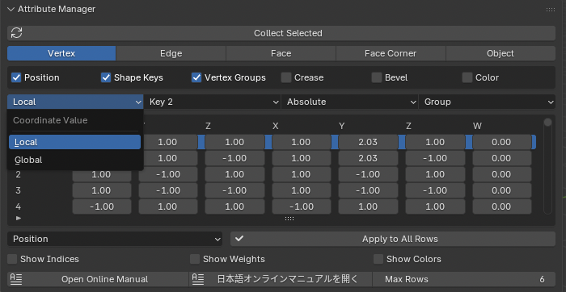

 

頂点ごとの属性編集ができます：

- 座標（X/Y/Z）
- Shape Key 値
- Vertex Group ウェイト
- クリース
- ベベルウェイト
- カラーアトリビュート（POINT）

座標値は ローカル / グローバル空間 の両方で表示できます。編集時は Blender 側に自動で変換されて反映されます。 

グローバル座標系の場合は、メッシュ頂点の座標値をグローバル座標系に変換して編集テーブルに表示し、編集した値はローカル座標系に変換してメッシュに書き戻しています。YT-Tools for Blenderの作業平面の機能と組み合わせて、作業平面上の頂点の座標値を揃えたい場合などで便利に使うことができます。シェイプキーとVertex Groupは、プルダウンメニューで選択されている対象データの値が対象になります。 

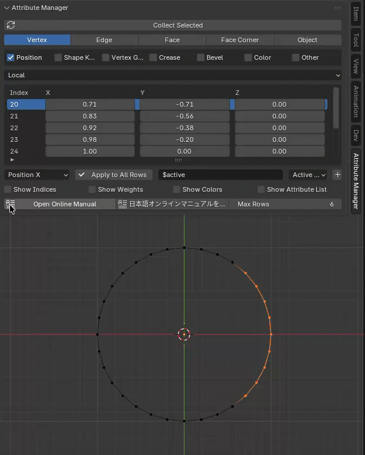

 

Shape KeyモードをRelativeにすると、座標値はBaseキーからの相対値で表示されます。 

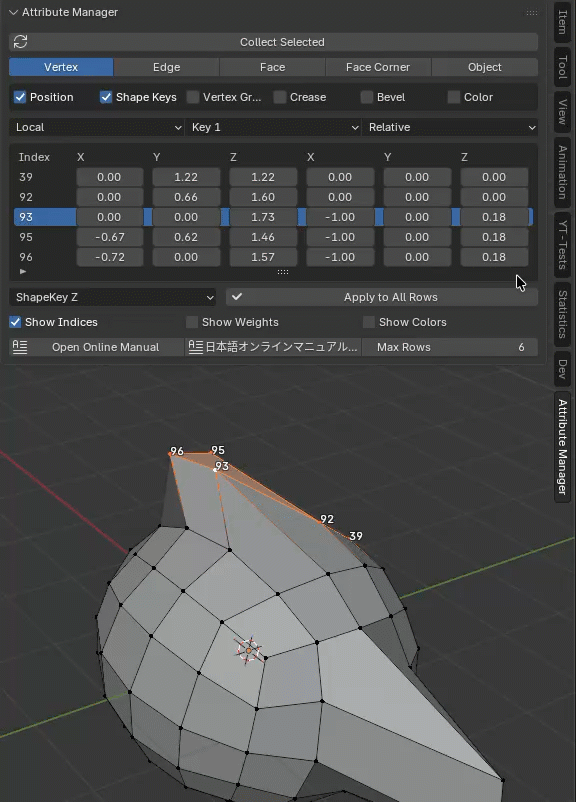

 

## エッジ編集モード

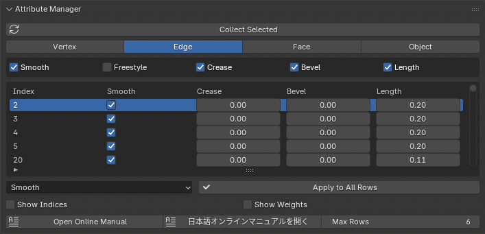

エッジに関する属性編集が可能です：

- smooth（スムース）
- Freestyleマーク
- crease（クリース）
- edge bevel weight（エッジベベルウェイト）
- Length（長さ）

これらの属性はサブディビジョンやシェーディングに影響します。Lengthはエッジの端点の頂点の座標値を変更し、指定した長さにエッジの中心位置を基準に長さを調整します。

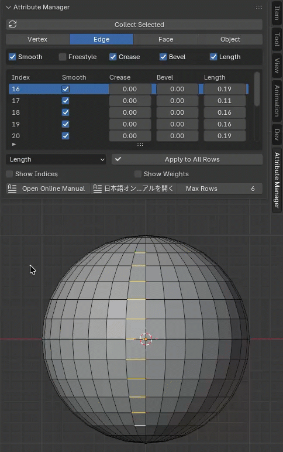

 

## 面編集モード

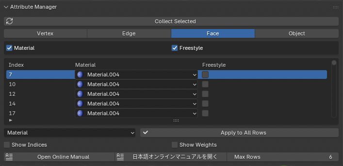

面ごとの属性編集ができます：

- マテリアルスロット
- Freestyleマーク

多くの面が同じマテリアルを共有する場合に一括編集が便利です。Freestyleの属性も変更可能です。

## 面コーナー編集モード

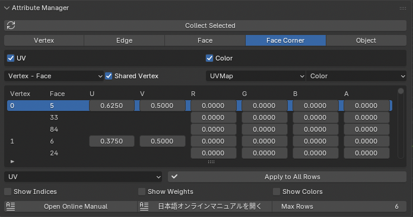

面の各コーナーに属する属性編集ができます：

- UV
- カラーアトリビュート (CORNER)

Blenderでは、UVやカラーアトリビュートは面の各コーナーごとに値を保持していて、必要に応じて頂点単位に編集を行ったり、切り離して独立した値を持たせることが可能です。 

Index Orderは、頂点番号と面番号をどちらを基準にテーブルを表示するかを指定します。<b>Face - Vertex</b>を指定すると面とその面を構成する頂点を順番に表示します。<b>Vertex - Face</b>を指定すると頂点とその頂点にリンクされている面を順番に表示します。 

<b>Shared Vertex</b>を有効にすると同一頂点において同じ面コーナーの値は同時に編集されます。同じ値を持つセルは表示されません。<b>Shared Vertex</b>をオフにすると面コーナー単位に独立して値を編集することができます。 

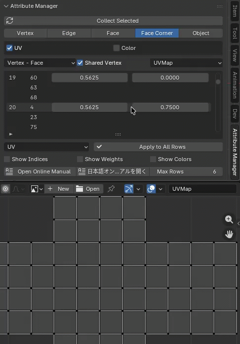

 

## オブジェクト編集モード

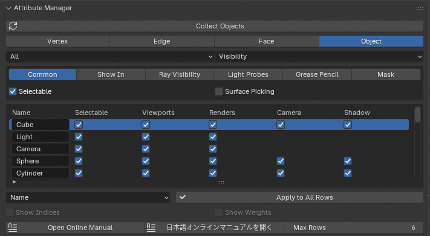

Object（オブジェクト）モード

オブジェクトに対する属性編集が行えます： 

- トランスフォーム（Transform）
- 関係（Relations）
- 可視性（Visibility）
- ビューポート表示（Viewport Display）
- ライトやカメラ特有のプロパティ

Object モードでは: 

- 上段のドロップダウンか編集対象のオブジェクトタイプ（Mesh/Light/Camera など）を選びます
- 現在、下記のオブジェクトのタイプ固有の属性の編集をサポートしています。
  - Mesh オブジェクト
  - Light オブジェクト
  - Camera オブジェクト
  - Empty オブジェクト
- 次のドロップダウンで属性カテゴリ（トランスフォーム/関係/可視性 など）を選びます

オブジェクトモードでは、オブジェクトの名称も変更することができます。<b>Apply to All Rows</b>を使って他のオブジェクトに同じ名称を設定した場合、Blenderが自動的に同じ名称のオブジェクトに対して連番を付加します。

## 変更履歴

### v1.0 新規リリース

- Attribute Manager for Blenderの新規リリース

### v1.1 新機能追加

- Face Conerモードの追加
- Color Attributeの追加
- Show Colorsボタンの追加
- Shape Keysで相対座標値の編集機能を追加

## License

This Blender add-on is licensed under the GNU General Public License v3.0 or later.

You are free to use, modify, and redistribute it under the terms of the GPL license.
For details, please see the included `LICENSE.txt`.
