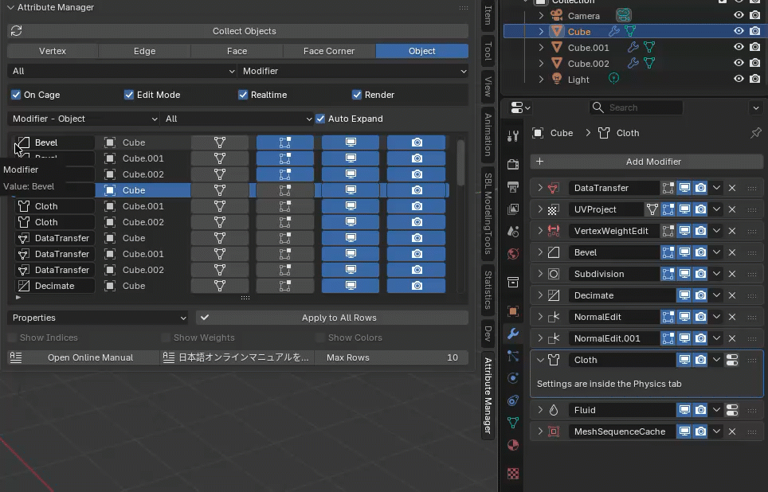
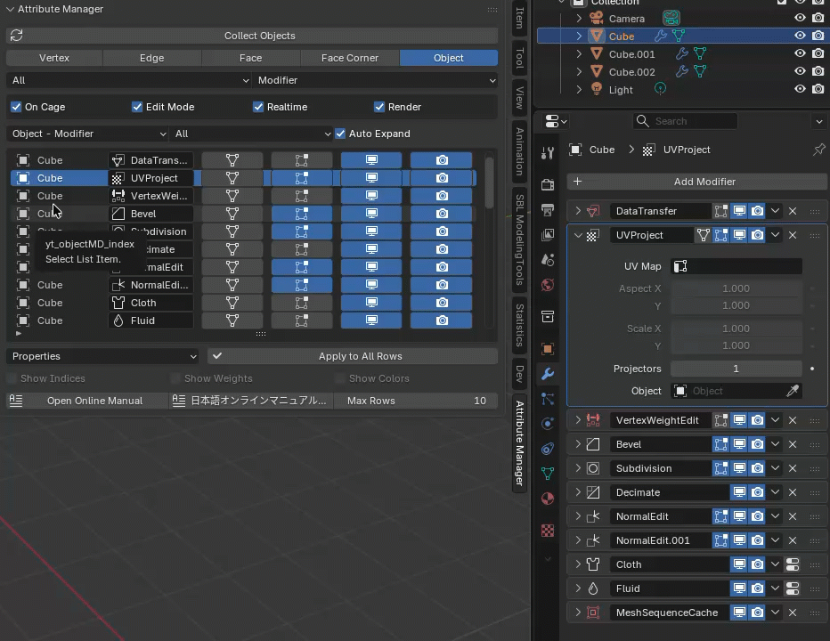

---
# Feel free to add content and custom Front Matter to this file.
# To modify the layout, see https://jekyllrb.com/docs/themes/#overriding-theme-defaults

layout: default
permalink: /AttributeManager/release_1_2.html
---
# Attribute Manager for Blender v1.2 Release Note

## ✨ New Features Overview

### 🔹 Modifier Mode
In Modifier mode, you can edit the display attributes of modifiers added to objects. The editing table can be switched between displaying the order of modifiers added to each object or the order of the objects to which each modifier is added.  
Also, if you set the item to <b>Properties</b> and execute <b>Apply to All Rows</b>, all properties of the modifier in the selected row will be copied to modifiers of the same type as the modifier in the selected row. This is useful when you want to set the same properties for all modifiers at once. Enabling <b>Auto Expand</b> will expand the properties panel for the modifier in the selected row and close all other panels.  

Apply all <b>Properties</b> of Bevel modifier to other bevel modifiers.  

<b>Auto Expand</b> exclusively expand the current selected modifier.
