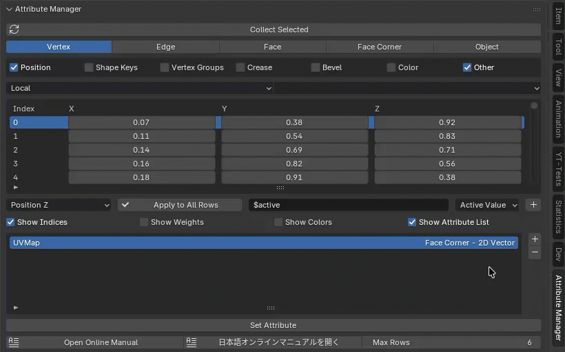
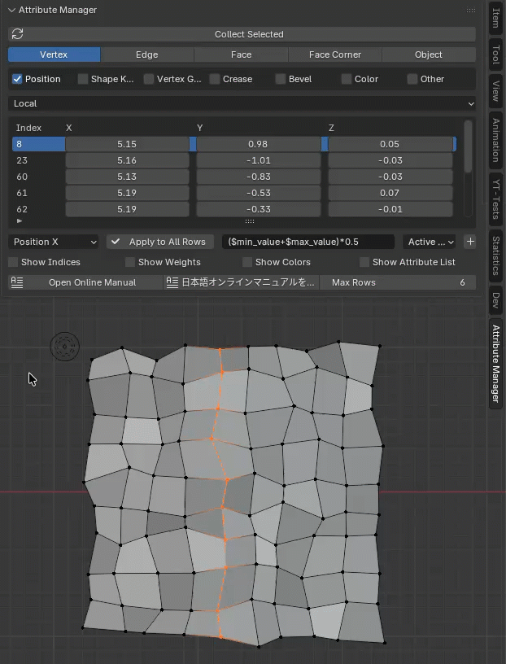
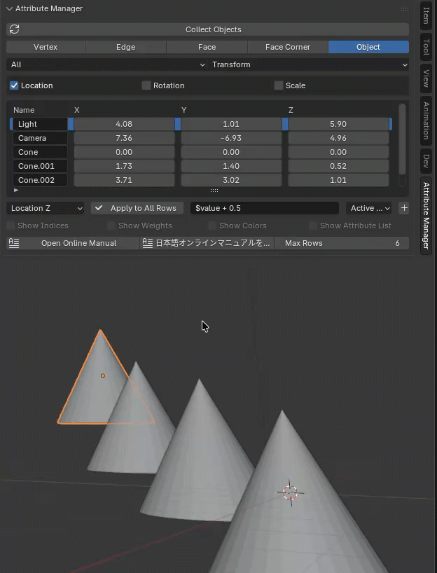

---
# Feel free to add content and custom Front Matter to this file.
# To modify the layout, see https://jekyllrb.com/docs/themes/#overriding-theme-defaults

layout: default
permalink: /AttributeManager/release_1_3.html
---
# Attribute Manager for Blender v1.3 Release Note

## ✨ New Features Overview

### 🔹 Attribute List
The Attribute List displays a list of attributes that can be edited in Edit Mode. Pressing the <b>Set Attribute</b> button sets the selected attribute to the editing table.
You can also add a user-defined attribute by pressing the + button to the right of the Attribute List. Pressing the - button deletes the currently selected attribute. 

 

### 🔹 Expression
The value of the specified float field will be calculated and applied to the same item in all rows based on the arithmetic formula. If you press "Apply to All Rows" for an item other than a float, the value of the currently selected active cell will be applied to all rows.  

Expression are based on Python's eval function and support all four basic arithmetic operations. The following variables are available for Attribute List expressions.  
You can also use Python's <a href="https://docs.python.org/3/library/math.html">math module</a>.  

- $active: The value of the specified item (cell) in the currently selected row.
- $value: The value of the specified item (cell) in the row being calculated.
- $min_value: The minimum value of the specified item (cell) in all rows.
- $max_value: The maximum value of the specified item (cell) in all rows.

You can add the above variables and basic operators to the field using the pop-up to the right of the input field.  

Example 1: Set all row values ​​to the value of the currently selected cell. 
<b>$active</b> 

Example 2: Add 2.0 to all row values. (If you are performing arithmetic on the current values, you can omit the first $value.) 
<b>$value + 2.0</b> or <b>+ 2.0</b> 

Example 3: Set all row values ​​to the minimum value of all rows. 
<b>$min_value</b> 

Example 4: Set all row values ​​to the midpoint between the minimum and maximum values ​​of all rows. 
<b>($min_value + $max_value) / 2.0</b> 

Example 5: Limit row values ​​to a specified range (0.0 - 1.0). 
<b>clamp($value, 0.0, 1.0)</b> 

Example 6: Set the square root of each value in all rows. 
<b>math.sqrt($value)</b> 

Example 7: Convert 10.0° to radians and add it to each value in all rows. 
<b>+ math.radians(10.0)</b> 

 

 