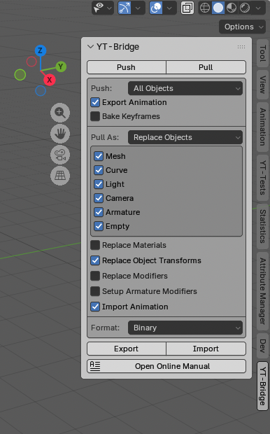
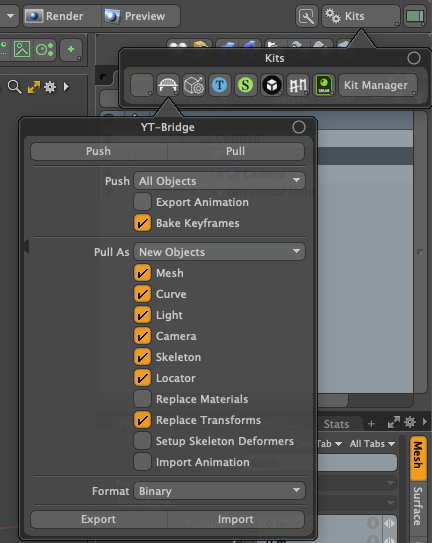
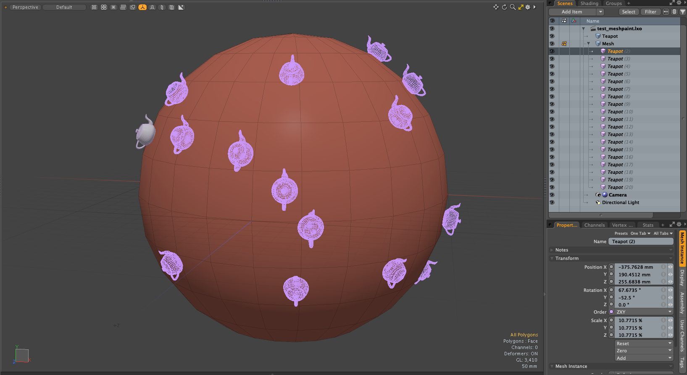
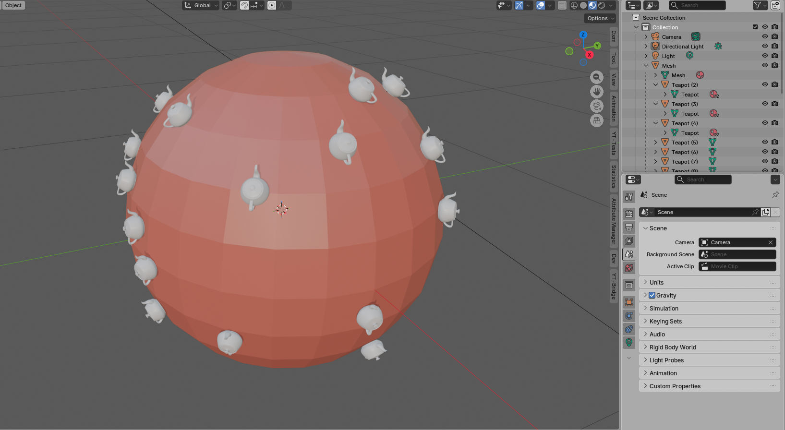
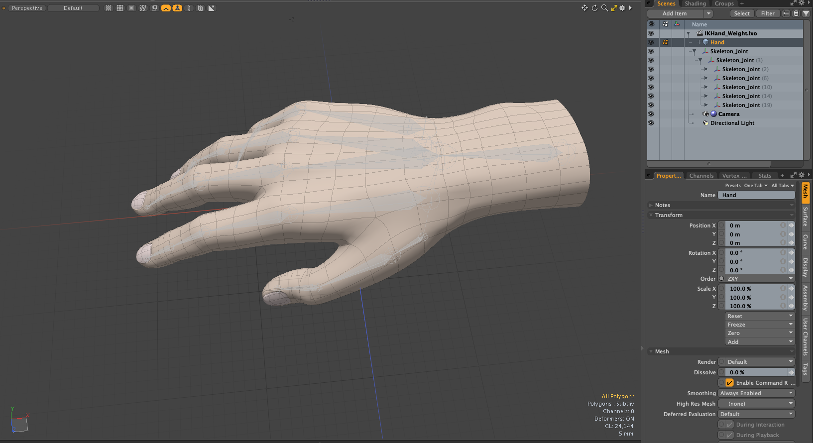
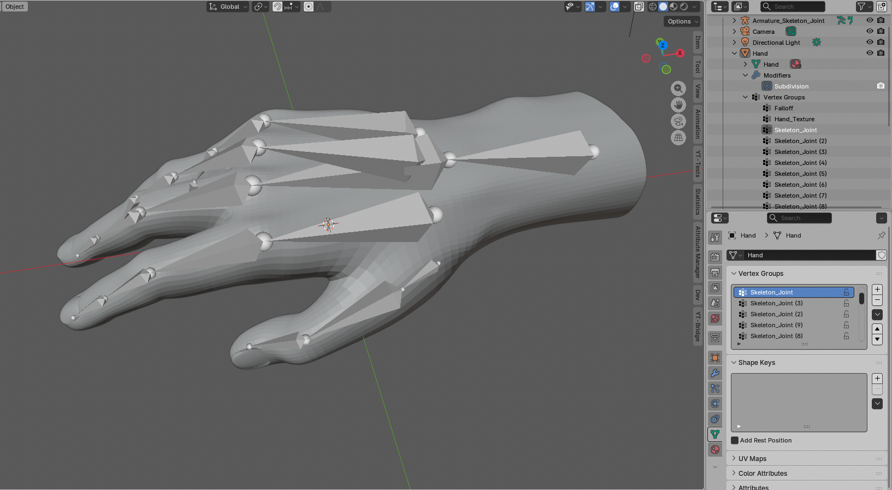
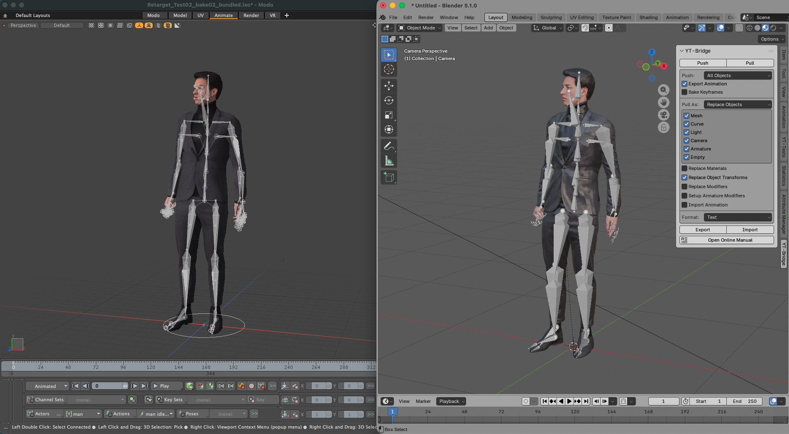
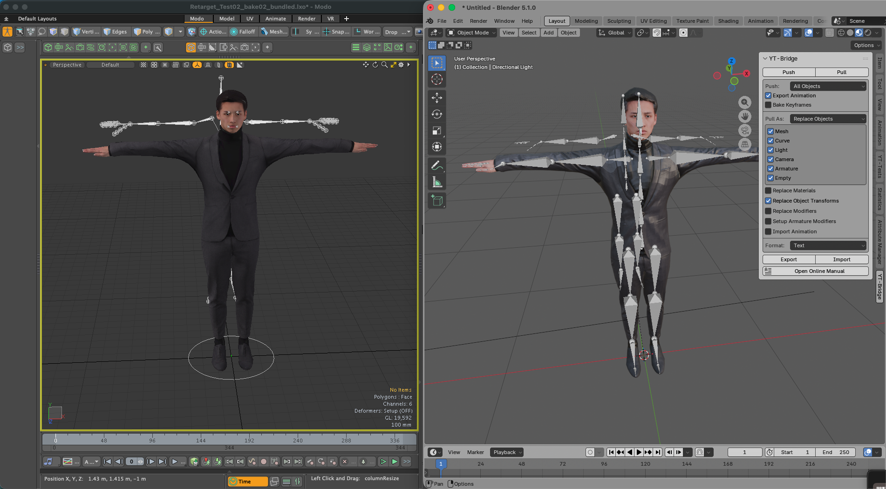
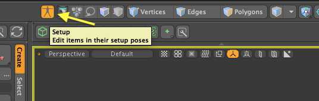

---
# Feel free to add content and custom Front Matter to this file.
# To modify the layout, see https://jekyllrb.com/docs/themes/#overriding-theme-defaults

layout: default
permalink: /yt-bridge/index.html
---

# YT-Bridge for Blender

- <a href="/yt-bridge/index_J.html">日本語ドキュメント</a>

# Overview

YT-Bridge for Blender is a tool for exchanging scene data between Blender and Modo. It can convert not only mesh data but also information such as lights and cameras. It can also be used to convert scene data from a newer version of Blender to an older version.

## Blender Version and Installation Method

- 4.0, 5.0 or later, or a derivative version
- The add-on is written in Python only and works on macOS and Windows.

### Installing the Blender Add-on

- Launch Blender
- Open Edit > Preferences from the menu
- Select Add-ons on the left
- Click Install from Disk and select yt_bridge_blender.zip
- Check the YT-Bridge checkbox to enable it.

## Modo Version and Installation Method

- Modo 16.1, Modo 17.1
- This kit is written as a Python plugin kit and works on macOS and Windows.

### Installing the Modo Kit

- Launch Modo
- Set the Python version to 3.9 in Modo's initial settings.
- Drag and drop yt_bridge_modo.zip onto the Modo view.
- Modo will restart, and YT-Bridge will become available.

### Differences from YT-Tools External Clipboard

YT-Bridge is a more advanced version of YT-Tools' external clipboard. While YT-Tools' external clipboard converts mesh polygon data and other attribute data via temporary files, YT-Bridge exchanges data on a Blender object (Modo item) basis.

| | YT-Tools | YT-Bridge|
|---------|------------------|------------------|
| Data Exchange Format | JSON Text | JSON Text/msgpack Binary |
| Data Exchange Method | Temporary File/OS Clipboard | Temporary File |
| Save/Load As | _ | ○ |
| Object Coordinate Values ​​| ○ | ○ |
| Mesh Data | ○ | ○ |
| Curve Data | ○ (*1) | ○ |
| Camera Data | _ | ○ |
| Light Data | _ | ○ |
| EMPTY Data | _ | ○ |
| Armature Data | _ | ○ |
| StaticMesh Data | _ | ○ (*2)|
| Linked Object | _ | ○ |
| Transform Animation | _ | ○ |
| Import Selection Options | _ | ○ |
| Material Overwrite Allowed | ○ | ○ |
| Specify Import Method | ○ (*3) | ○ |
| Data Exchange with LightWave | ○ | _ |

(*1) Supports copy and paste only between Blender instances. 
(*2) Converts Modo's StaticMesh to a Mesh object and outputs it. 
(*3) Pastes into a new object as "New Object from Clipboard". 

## Data Exchange Method

YT-Tools external clipboard uses JSON text as the format for exchanging intermediate data. This JSON text data exchange method supports temporary files and the OS-provided clipboard. YT-Bridge supports a binary format in addition to JSON text, which results in a more compact file size. Binary data is serialized using Python's msgpack. Binary file input/output is generally faster than text format, but actual input/output speed depends on the environment used. YT-Bridge does not support the OS-provided clipboard.  

The save format is specified in the panel's format options.

## Pushing (Exporting) Object Data

YT-Bridge's push operation is equivalent to YT-Tools' copy operation, saving object data to an intermediate file using the specified method. The data in the intermediate file must be manually pulled from the target application. YT-Bridge does not provide an automatic import function using Inter-Process Communication.

- All Objects (All Items) 
Exports all supported objects in the scene. If Export Hidden Items is turned off, hidden objects will not be exported.

- All Objects (All Mesh Items) 
Exports all mesh objects in the scene. 

- Selected Objects (Selected Items) 
Exports the selected objects in the scene.

- Selected Mesh Faces 
Exports only the selected polygons of the selected mesh objects in the scene. If nothing is selected, or in object mode, all polygons are output.

- Export Animation 
Exports the basic position, rotation, and scale animations of the object.  If possible, keyframes are exported at the FCurve (Channel) level, and keyframes requiring matrix transformation are output as XYZ coordinate values. <ins>Bone animation is not supported.</ins> 

- Bake Keyframes 
When Bake Keyframes is enabled, the XYZ coordinate values ​​evaluated at each frame are exported. Otherwise, keyframes are exported at FCurve (Channel) keyframes with ganged components.

## Object Data Pull (Import)

The YT-Bridge pull operation is equivalent to the YT-Tools paste operation, and imports object data saved in the intermediate file into the scene in the specified way.

- New Objects (New Items) 
Imports data saved in the intermediate file as new objects.  

- Replace Objects (Replace Items) 
Overwrites object data saved in the intermediate file with an object in the scene with the same name. If there is no object with a matching name in the scene, it is imported as a new object.

- Duplicate and Replace Objects (Duplicate and Replace Items) 
This is the same as Replace Objects, but it creates a copy of the original object before overwriting the object data. The duplicated object is set to hidden. Use this mode when you want to proceed with overwriting object data but want to keep a backup of the original data as a precaution.

- Select Object Type 
Specify the type of object to import using the toggle button. Mesh, Curve, Light, Camera, Empty, and Armature can be selected.

- Replace Materials 
Enabling Replace Materials overwrites the material data in the scene with the material data saved in the intermediate file. To prioritize the imported material, this option must be turned off.

- Replace Object Transforms 
Enabling Replace Object Transforms overwrites the object coordinate data in the scene with the object coordinate values ​​saved in the intermediate file. To prioritize the imported object coordinate data, this option must be turned off.

- Replace Modifiers 
YT-Bridge also saves modifier information set on Blender mesh objects, etc., in the intermediate file. Enabling Replace Modifiers will overwrite the modifiers in the scene with the modifier data saved in the intermediate file. Modifier overwriting can only be used in push-pull operations between Blenders.

- Setup Armature Modifiers (Setup Skeleton Deformers) 
Enabling this option sets modifiers (deformers) that map bones to Vertex Groups (vertex weight maps) when importing intermediate data.

- Import Animation 
Object Transform animation data is imported.

## Saving and Importing Named Files (Export/Import)

YT-Bridge creates intermediate files as temporary files in a folder provided by the OS and exchanges data between applications. Export/Import provides the function to save and import these data files to any folder with a file name specified by the user.

## Data Conversion Details

### Object Coordinate Data

Blender object and Modo item coordinate data are output in their respective local coordinate systems, including position, rotation, scale, and rotation order. Blender's coordinate system is a right-handed coordinate system (Z-Up), and Modo's coordinate system is a right-handed coordinate system (Y-Up). Coordinate values ​​are converted when reading from an intermediate data file. Object parenting information is also saved in the intermediate file.

### Linked Objects (Instance Items)

Modo instance items are mutually convertible to Blender linked objects. In Blender, the first linked object in the scene is saved as a physical object in an intermediate file, and subsequent linked objects are output as instances.

<i>Converting Modo instance items created with Mesh Paint to Blender Link Objects</i> 

### Mesh Data

Mesh data exchanges the mesh data of Blender's Mesh objects with the polygon data of Modo's Mesh items of surface types (Face, SubD, PSub). Other polygon types (Text and Polyline) are not exchanged as Mesh data. Curve data is exchanged as Curve objects.  
The coordinate system of vertex coordinate values ​​(Blender's coordinate system is a right-handed coordinate system, Z-Up; Modo's coordinate system is a right-handed coordinate system, Y-Up) is converted when importing from an intermediate file.  
Modo's Static Mesh is output as Mesh data.  

In addition to basic vertex and polygon information, the following information is exchanged as Mesh data.  

- Polygons (Surface Type Polygons) 
Of Modo's polygons, Face, Subdivision Srace, and Catmull-Clark Subdivision type polygons are output as Polygons. Keyhole type polygons are divided into triangles and output.  
- UV Sets (UV Map) 
All UV maps within the Mesh are output to the intermediate file.  
- Edge Crease (Subdivision Weight) 
The edge weights of Subdivision Srace and Catmull-Clark Subdivision are output to the intermediate file.  For compatibility with Blender's Subdivision modifier, the square root of Modo's edge weight values ​​is output.  
- Shape Keys (Morph) 
Modo's morph maps are output to the intermediate file.  Relative and absolute morph maps are output.  
- Vertex Groups (Weight Map) 
Modo's vertex weight maps are output to the intermediate file and imported as Blender's Vertex Groups.  
- Color Attributes (RGBA Map) 
RGB and RGBA map data are output to the intermediate file. They are imported as color attributes of Blender's Float type FaceCorner.  
- Freestyle Edges, Freestyle Faces (Selection Sets) 
Blender's Freestyle edge and face information is output as Modo selection sets.  Edge selection sets named "_Freestyle" are treated as Freestyle data.  
- Selection Sets (Selection Sets) 
Modo's selection sets are output as selection sets handled by YT-Tools. This data is output as a custom attribute prefixed with "sset@".  
- Custom Normals (Vertex Normal Map) 
Modo's vertex map is output to an intermediate file and imported as Custom Normals in Blender.  
- Edge Sharpness (Hard Edge Map) 
Modo's Hard Edge map is output to an intermediate file and imported as Edge Sharpness in Blender.  
- Subdivision Surface 
If all polygons in Modo's Mesh are Catmull-Clark Subdivision, the Catmull-Clark subdivision level attribute is output to the intermediate file.  If this information exists, a Subdivion modifier is added to the Blender MESH object.  
- Materials 
The base color and roughness values ​​of the material are output to the intermediate file. The texture output includes color, normal map, and roughness image textures.

### Curve Data

The curve data is exchanged between the curve data of Blender's Curve object and the Curve, Bezier Curve, and B-Spline Curve within Modo's Mesh item. Modo's Catmull-Rom curves are converted to Bezier curves and output. Blender's NURBS are converted to Modo's B-Spline curves and output. Weight values ​​are not exchanged.

### Camera Data

The camera data outputs camera field of view information, lens type (perspective, parallel), focal length, and DOF focal length to the intermediate file.

### Light Data

The light data outputs information about the light type (point, spot, area, directional). Modo's directional lights are converted to Blender's Sun lights. Additionally, the light's color and intensity are output. Modo's Intensity and Blender's Energy have different units, but a coefficient (40.0) is multiplied based on the ratio of their respective scale ranges. (Blender energy range (0-200), Modo intensity range (0-5))

### Empty Data

Empty data is output as a Modo locator item and exchanged for a Blender EMPTY object. Only the coordinate data of the object (item) is output.

### Armature Data

Armature data is created by converting the data of the locator item used as the Modo skeleton to the data of a Blender Armature object. Because the data structure of the Joint items that make up the Modo skeleton and the Bone of the Blender Armature object are different, hierarchical structures with multiple branching parent-child relationships are not fully converted. Anchor items located at the ends of the Modo skeleton are not output, but are output as the Tail coordinate values ​​of the Bone.  
Modo's skeletons use locator items as Joint items, which can make it difficult to determine which locator is being used as a Joint. YT-Bridge distinguishes between Joints and generic Locators using the following checks:
- If the item has a BONE tag string. The Skeleton Draw tool writes this BONE tag string.
- If the IK Joint package has been added to the item. Executing the Bind command adds the IK Joint package and General Influence.
- If the Link channel is set to Custom or Line, it is recognized as a Joint.

<i>Converting Modo Skeleton to Blender Bones</i> 

### Animation Data

Animation data exchanges the position, rotation, and scale values ​​of basic objects (items) in FCurve (Channel) units or XYZ coordinate units. Blender's Quaternio rotation data is converted to Euler angles (XYZ) in Modo. If Bake Keyframes is enabled, the XYZ coordinate values ​​evaluated at each frame are exported. <ins>Animation data other than object (item) transforms is not supported.</ins><ins>Also, animation data for skeleton bones is not supported.</ins><ins> </ins>

### Material Data

The material outputs basic diffuse color and roughness values. The texture outputs diffuse color, normal map, and roughness image textures. Other image textures are also output, but if there is no corresponding effect, they will not be reflected in the scene. Basically, the material is assumed to prioritize the material set in the master application. Only when the <b>Replace Materials</b> option is enabled will the imported material overwrite existing materials.  The texture color space is explicitly converted only for sRGB and None-Color. For all others, the default value for each application is used.  

### Modifier (Deformer) Settings

Enabling Setup Armature Modifiers (Setup Skeleton Deformers) sets the modifiers (deformers) that map bones to Vertex Groups (vertex weight maps) when importing intermediate data. In Blender, the Armature modifier is set, and in Modo, the General Influence deformer is set.  

### <ins>Scene Output in Setup Mode</ins>

In Modo, if mesh operators or other deformers are applied to a MESH, the mesh at the current frame with the mesh operators applied will be output. To output the base mesh before mesh operators or other deformers are applied, you need to enable Modo's Setup mode and perform a YT-Bridge Push operation. Particular caution is needed if you are using a morph deformer, as this will prevent Blender's shape key base mesh from being output correctly.  

<i>Normal Scene Output</i> 

<i>Scene Output in Setup Mode</i> 

## Change Log

### v1.0 New Release

- New release of YT-Bridge for Blender

### Bridge for Modo v1.0.1 Bug Fix

- Fixed an issue where, when exporting a mesh containing both curves and surface polygons, only the curves were exported.

### Bridge for Modo v1.0.2 Bug Fix

- Fixed an error with negative edge weight value
- Export source items of instance evenif they are invisible.
- Resolved alias for image path in asset library.
- Export group locator as EMPTY object

### Bridge for Modo v1.0.3 Bug Fixes

- Fixed an issue where the replicator's source item would not export even if it was hidden.
- Added the Export Hidden Items option.

### Bridge for Blender v1.0.1 Bug Fixes

- Fixed an error that occurred when the material was set to None.
- Fixed a bug where the Subdivide modifier was not set correctly.

### Bridge for Modo v1.0.4 Bug Fixes
- Fixed a bug where the default Colorspace was being converted to Non-Color
- Fixed a bug where the Transform of items with multiple Transforms was not being converted correctly

## License

This Blender add-on is licensed under the GNU General Public License v3.0 or later.

You are free to use, modify, and redistribute it under the terms of the GPL license.
For details, please see the included `LICENSE.txt`.

