---
# Feel free to add content and custom Front Matter to this file.
# To modify the layout, see https://jekyllrb.com/docs/themes/#overriding-theme-defaults

layout: default
permalink: /yt-tools/
---

# YT-Tools for Blender
This addon is a collection of tools useful for Blender modeling workflow. It contains utilities that are mainly aimed at Modo users to make Blender easier to use. 

## Blender version
- 4.0 and above or derivatives
- The addon is written in Python only and works on macOS, Window and Linux.

## Installation
Install yt-tools.zip from the Add-ons menu in Blender Preferences and enable YT-Tools.

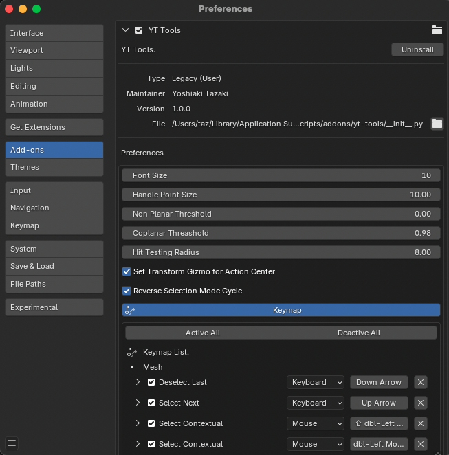

 

## Usage
Basic functions can be accessed from the "YT-Tools" tab in the sidebar. Some functions are mapped to shortcut keys or mouse clicks.

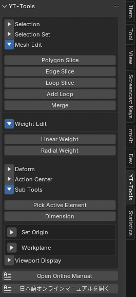

 

## Selection functions
### <ins>Select Convert Edge to Face</ins> 
In Edit Mode mode, selects faces with two or more selected edges and sets the current selection mode to Face. 
### <ins>Select Convert Vert to Face</ins> 
In Edit Mode mode, selects faces with three or more selected verts and sets the current selection mode to Face. 
### <ins>Select Boundary</ins> 
In Edit Mode mode, selects all edges on the border between selected and unselected faces and sets the current selection mode to Edge. 
### <ins>Select Next / Deselect Last</ins>(shortcut only) 
In Edit Mode, selects the next element based on the selection pattern of two or more selected faces (or edges, or verts). This function corresponds to Modo's select.more/select.less and is set to the up and down arrow keys on the keyboard. The down arrow deselects the last selected element. Both shortcut keys have the Repeat flag turned on, so holding down the key will select consecutive elements one after another. Select Next uses the standard Blender operator mesh.select_next_item.
### <ins>Select Contextual</ins> (mouse double-click only) 
In Edit Mode, double-clicking a face with the mouse selects other faces connected to that face. Double-clicking an edge selects an edge loop. Double-clicking while holding down the SHIFT key selects the aforementioned elements in addition to the existing selection. 
<ins><b>Limitations: </b>The double-click shortcut does not work in Circle selection mode in the 3D View or when UV sync is off in the UV Editor. This is due to some limitation on Blender, and there is currently no workaround.</ins>

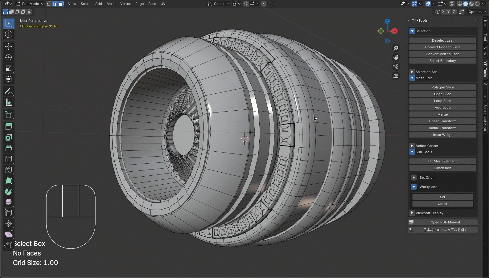

### <ins>Select Loop</ins> (shortcut only) 
In Edit Mode, selects a loop of faces or edges in a Modo-like way. In Face mode, pressing L while two consecutive faces are selected selects the adjacent faces in a loop. In Edge mode, selecting an edge and pressing L selects an edge loop.
### <ins>Cycle Edit Mode</ins>  (shortcut only) 
In Edit Mode, cycles through the currently selected edit modes in the order Face, Edge, and Vert. Assigned to the spacebar.
### <ins>Select Loop Direct</ins> (shortcut only) 
This is the same as Blender's standard loop selection with Alt + LMB, but it registers the selected elements in the selection history in order. This allows you to deselect the last selected element and the elements selected in order by executing Deselect Last, which is assigned to the down arrow key.

## Selection Set
Selection Set is a function that saves the selection state of vert, edge, and face to a mesh with a name. This information is saved as custom data for the mesh. It is saved in the Blender scene file, so it is retained even if you reopen the saved scene. Add adds the currently selected mesh elements to the Selection Set. Selection Sets are saved separately for verts, edges, and faces. Remove deletes the currently displayed Selection Set. Enabling Remove All deletes all Selection Sets saved for the current Edit mode. Select selects the elements saved in the currently displayed Selection Set.  
Push, Pop, and Clear are functions that temporarily save the state of the currently selected elements and recall the selection state when necessary. Basically, they use the same mechanism as Selection Set, but you can push and pop the selection state like a clipboard without explicitly saving it with a name. This selection state is also saved as custom data, so we recommend pressing the Clear button to delete the selection data when it is no longer necessary.

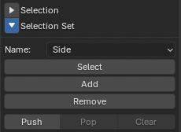

 

## Mesh Editing
### <ins>Loop Slice</ins> 
Loop Slice is an operator developed to achieve behavior similar to Modo's Loop Slice. This operator is launched with one edge or two consecutive faces selected. Slices a ring of selected edges or edges that share two faces into loops. If you select a face and choose the option Selected, only the selected faces are sliced, and other unselected faces are masked and not sliced. This operator also slices symmetrically positioned loops if you set the symmetric mode of this tool. 
Enable Symmetric_Cut to set the slice position symmetrically within the loop. Enable Preserve Curvature to adjust the slice position on the bezier curve made by the edges connected to the sliced edge. Use the Tension value to adjust the height adjusted by Preserve Curvature. This operator is mapped to the Alt-L shortcut, just like Modo's Loop Slice. 

Cut Positions by Spans is a mode in which you directly specify the number and spacing of slices in the ratio of each span. For example, entering "1 3 1" will divide the polygon loop into thirds in a 1:3:1 ratio. Enter each span separated by a space character. Spans are normalized by dividing by their total number, so you can enter numbers of any scale. If a span is entered in this field, it will overwrite the divisions and Symmetic Cut.

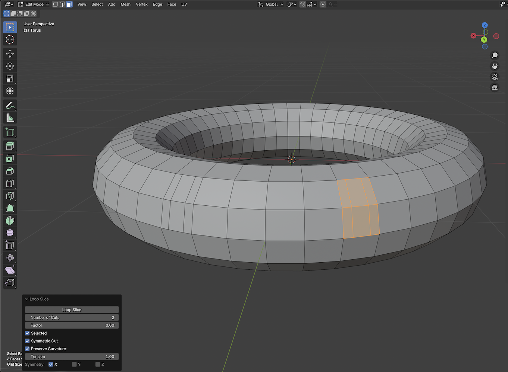

### <ins>Add Loop</ins> 
Add Loop is an interactive version of Loop Slice, where you click directly on the edge of the loop to slice. When you click on the edge, a yellow slice line appears. You can change the slice position by dragging the handle that appears at the clicked position. Press SPACE to confirm the slice and exit the tool. Press RETURN to confirm the slice but continue the tool, allowing you to perform the next slice operation consecutively. Add Loop has an Absolute Distance option that slices the slice position by the distance on the clicked edge rather than the ratio of each edge. When this option is enabled, other edges are divided based on the distance of the clicked edge's division position. This is useful when you want to move the slice loop line in parallel. Enabling Offset from End will offset from the opposite side of the edge.

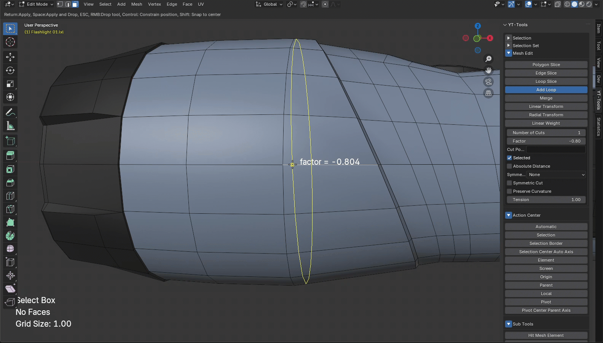

### <ins>Delete Contextual</ins> (shortcut only) 
In Edit Mode, deletes the selected Face, Edge, or Vert in a Modo-like manner. In each selection mode, pressing Backspace or Delete will delete the selected element. This command refers to the symmetry mode that can be specified in the upper right corner of the 3D view. If there is a symmetric element for the selected element, the element will be deleted at the same time. In Face mode, the Delete Face command is executed, and in Edge and Vert modes, Dissolve Edge and Dissolve Vert are executed.

### <ins>Polygon Slice</ins> 
Polygon Slice is an operator developed to achieve behavior similar to Modo's polygon slice. When you press the Polygon Slice button to launch Polygon Slice, the mouse cursor becomes a knife shape. Click and drag in the 3D View to display the slicing line and handles. The slicing axes are X, Y, Z, and screen direction. The default is screen direction, and can be changed from Axis in the sidebar. The position of the slice can be adjusted with the start handle, end handle, and center handle. Hold down the Ctrl key while dragging a handle to constrain the handle movement to the horizontal or vertical direction of the screen. Hold down the Shift key while dragging the screen to reset the initial slice handle. Press the Return key on your keyboard to apply the slice to the mesh. The mesh will not be sliced until you press this key. To check the slice state before executing, you can preview the slice by pressing P key. This operator also slices the symmetrical loop at the same time if you set the symmetry mode of this tool.
 
* Ctrl + LMB click: Constrain the handle movement to the horizontal or vertical direction of the screen. 
* Shift + LMB click: Draw a new slice line. 
* Return key: Confirm the slice and change the mesh. The tool continues. 
* Space key: Confirm the slice and change the mesh. The tool ends. 
* P key: Shows a preview. 
* ESC key, RMB click: Exit the tool without changing the mesh. 
<ins>Limitations: Tool handle movement does not support snapping because Blender does not expose the Snap API. This operator also does not work in 4-view view mode. This is because Blender displays 4-view as a special view, and the add-on cannot correctly recognize 4-view.</ins>

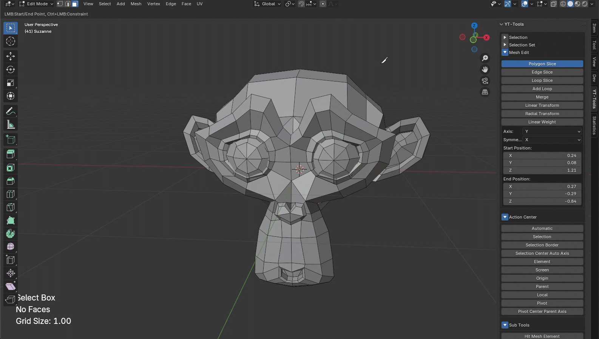

### <ins>Linear Transform</ins> 
Linear Transform is a transform operator with a linear falloff. The degree of transformation falls off along the line segment displayed as a diamond. Move Offset, Scale, and Angle specify the relative amount of movement, scale, and rotation to transform, respectively. The center of rotation and scale refers to the currently set Transform Pivot Point. Transform Orientation supports only Normal. The rest conform to the Global direction. Hold down LMB and select Hauling or Tracking in the 3D view. 
<b>Shape</b> specifies how the falloff is calculated. The default is Linear, which means the falloff is linear. 
Enabling <b>Reverse</b> causes the falloff to fall from Linear End to Linear Start. 
<b>Mirror</b> mirrors the falloff shape at Start or End. The falloff affects both the original falloff shape and the mirror shape. 
<b>Symmetry</b> transforms the selected elements symmetrically along the specified axis. 
<b>Auto Fit</b> moves Start and End to fit the falloff shape to the selected mesh elements in the specified direction. 
Enabling <b>Show Axis</b> displays axis handles at the Start and End positions of the falloff shape. 
* G, R, S keys: Switch between moving, rotating, and scaling. 
* LMB drag: Drag the mouse to change the value of the item set by Hauling with Hauling. 
* LMB + Shift drag: Draw a new falloff shape. 
* LMB + Control + Shift drag: Draw a new falloff shape horizontally or vertically. 
* LMB + Alt drag: No changes are made until the mouse button is released. Useful for quickly aligning handle operations on heavy meshes. 
* Return key: Confirms changes and resets changes. 
* ESC key, Space key, RMB click: Exit the tool. 

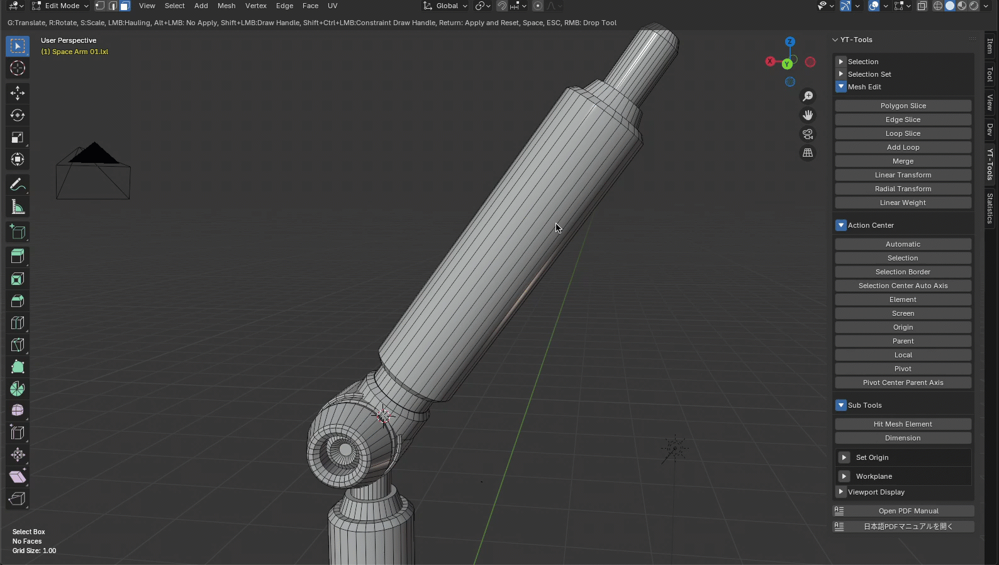

### <ins>Radial Transform</ins> 
<b>Radial Transform</b> is a transform operator with a radial falloff. The degree of transformation is attenuated in a circular shape. Move Offset, Scale, and Angle specify the relative amount of movement, scale, and rotation to transform, respectively. The center of rotation and scale refers to the currently set Transform Pivot Point. Transform Orientation only supports Normal. The rest follow the Global direction. You can interactively change the transformation value by manipulating the Hauling or Transform Handle in the 3D view while holding down the LMB. The items used for the Hauling operation can be specified in the Hauling menu. They are also assigned to the shortcut keys T, R, and S, so they can also be changed using keyboard shortcuts. Radial Center and Radial Side are the center point of the radial falloff and the radius of the sphere. The closer to the center point, the smaller the falloff weight, and the farther away from the center, the larger the movement. The weight on the outside of the sphere is zero. These positions are set to fit the bounding box of the currently selected mesh element when the operator is started. You can redraw this sphere by dragging in the 3D view while holding down the Shift key. You can also constrain the drag direction to horizontal or vertical by holding down the Ctrl key and dragging the LMB. 
<b>Shape</b> specifies how the falloff attenuation is calculated. The default is Linear, which performs linear falloff. 
<b>Symmetry</b> transforms the selected elements symmetrically along the specified axis of symmetry. 
* G, R, S keys: Switch between moving, rotating, and scaling 
* LMB drag: Change the value of the item set by Hauling by dragging the mouse. 
* LMB + Shift drag: Redraw a new falloff shape. 
* LMB + drag side handle: Resize the falloff size on each axis. 
* LMB + Shift + drag side handle: Resize the falloff size equally on all axes. 
* LMB + drag center handle: Move the entire falloff shape.。 
* LMB + Control + drag side handle: Move the entire falloff shape. 
* LMB + Alt drag: No changes are made until you release the mouse button. Useful for quickly aligning handle operations on heavy meshes. 
* Return key: Confirms changes and resets modified values. 
* ESC key, Space key, RMB click: Exits the tool. 

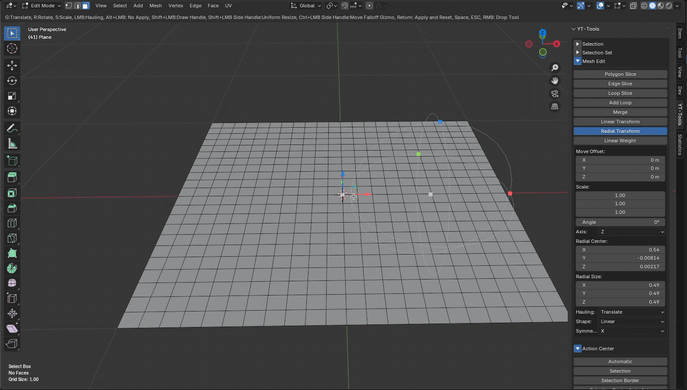

### <ins>Edge Slice</ins> 
Edge Slice is an interactive slicing tool with operability similar to Modo's Edge Slice, and allows you to slice a face continuously between the edges you clicked. This tool supports symmetry, and you can slice symmetrically positioned faces at the same time by selecting a symmetry axis from the Symmetry option that appears when you press the Edge Slice button to start the tool. In addition, if an edge is selected across faces or you click on a face, a handle is added in the currently operated view direction. Each handle can be moved after it is added. The following operations are available. 
* LMB click: Click on an edge or face with the LMB to add a new handle. You can move the added handle by moving it while holding down the LMB. 
* Control + LMB click: Click on a handle on an edge while holding down the Control key to snap it to a position every 10% on the edge and move it. 
* Shift + LMB click: Click on an edge or face to add a handle to the center of that element. 
* Space key: Confirm the slice and change the mesh. Exit the tool. 
* Control + Z key: Delete the last added handle. 
* ESC key, RMB click: Exit the tool without changing the mesh. 

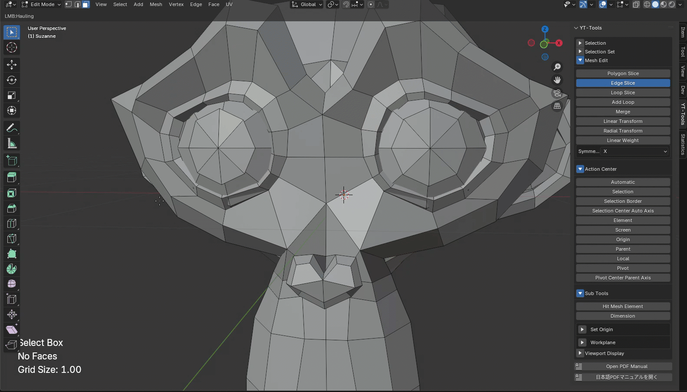

### <ins>Merge</ins> 
Merge is a standard Blender merge operator with symmetry added. This operator calls bpy.ops.mesh.merge internally and has the same options as Blender's merge operator except for the Symmetry option. For more information, please refer to the Blender manual.<https://docs.blender.org/manual/ja/latest/modeling/meshes/editing/mesh/merge.html>

* At Center: 
Places the remaining vertices at the center of the selection. Available in all selection modes.
* At Cursor: 
Places the remaining vertices at the 3D Cursor position. Available in all selection modes.
* Collapse: 
All islands of selected vertices (connected by the selected edges) are merged at their own midpoints, leaving one vertex per island.
* At First: 
Places the remaining vertices at the position of the first selected vertex. Available in Vertex selection mode only.
* At Last: 
Places the remaining vertices at the position of the last selected vertex (active vertex). Only available in Vertex selection mode.
* UVs(UV):
If UVs is checked in the Adjust Last Operation panel, UV mapping coordinates will be adjusted, if any, to avoid image distortion.
* Merge By Distance: 
Merges geometry around selected vertices, merging selected mesh vertices or point cloud points within the specified distance.

### <ins>Linear Weight</ins> 
Linear Weight is an operator that sets the weight used for linear falloff. The weight set along the line displayed as a diamond is set to the currently selected Vertex Group. If there is no active Vertex Group, a new Vertex Group is created and the weight value is added to it. Weight is the weight value to be set, and Replace replaces the existing weight value with the set weight. Additive and Subtract add or subtract a new value to the existing weight value. Linear Start and Linear End are the coordinate values of the start and end points of the linear falloff. The falloff weight is larger the closer to the start point, and the smaller the movement is as it is attenuated as it is closer to the end point. These positions are set to fit the bounding box of the mesh element currently selected when the operator is started. You can redraw this line by dragging the 3D view screen while holding down the Shift key. Also, dragging the LMB while holding down the Ctrl key will constrain the drag direction to horizontal or vertical. 
<b>Shape</b> specifies the falloff attenuation calculation method. The default is Linear, which causes linear attenuation. 
Enabling <b>Reverse</b> causes attenuation from Linear End to Linear Start. 
<b>Mirror</b> mirrors the falloff shape at the Start or End. The falloff affects both the original falloff shape and the mirror shape. 
<b>Symmetry</b> transforms the selected elements symmetrically around the specified axis of symmetry. 
<b>Auto Fit</b> moves the Start and End to fit the falloff shape to the selected mesh elements in the specified direction. 
<b>Show Axis</b> displays axis handles at the Start and End of the falloff shape. 
<b>Show Weight</b> enables Vertex Group Weights in the Mesh Edit Mode Overlays panel and displays the weights on the mesh in a gradient color. 
* G, R, S keys: Toggle Move, Rotate, Scale 
* LMB drag: Drag the mouse to change the value of the item set by Hauling with Hauling. 
* LMB + Shift drag: Draw a new falloff shape. 
* LMB + Control + Shift drag: Draw a new falloff shape horizontally or vertically. 
* LMB + Alt drag: No changes are applied until the mouse button is released. Useful for quickly aligning handle operations on heavy meshes. 
* Return key: Confirms changes and resets changes. 
* ESC key, Space key, RMB click: Exit the tool. 

## Viewport Display
Viewport Display is a function that changes the viewport display attributes of selected and unselected mesh objects all at once. In Blender, mesh objects have Viewport Display as a property that can be set for each individual object, but this sets this attribute all at once. Active Meshes sets the display attributes for selected mesh objects, and Inactive Meshes sets the display attributes for unselected mesh objects. Enabling Set Only Active Meshes and pressing the Set Attributes button will make no changes to unselected mesh objects and will only change the display attributes of selected mesh objects.

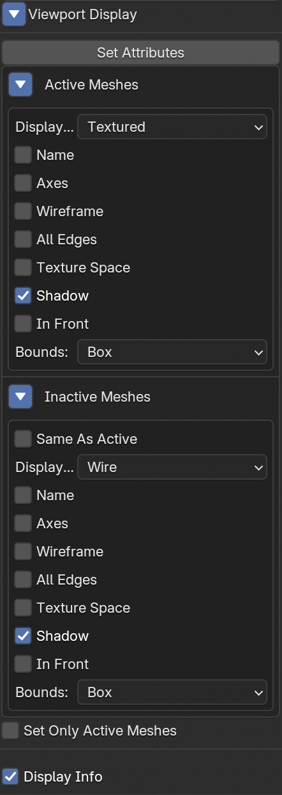

## Display Info 
When Display Info is enabled, the following information is displayed in text at the bottom left of the 3D viewport. 
### Tool Name 
The name of the currently selected tool is displayed.
## Element Information 
Displays the number of Faces, Edges, and Verts selected in Edit Mode, or information on a single element. If one Vert is selected, the local coordinate value of the vertex is displayed. If one Edge is selected, the edge length is displayed. If multiple Edges are selected, the total length of the selected Edges is displayed. If one Face is selected, the number of vertices of the Face, the assigned material name, and the area are displayed. If multiple Faces are selected, the total area of the selected Faces is displayed.
## Grid Size 
Displays the scale of the Grid set in the Viewport Overlays panel.

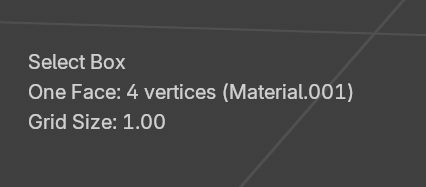

You can change the font size used for this display information in the YT-Tools tab of the Preferences panel. This information is saved as the initial setting, so it is permanently used as a common setting for the scene file.

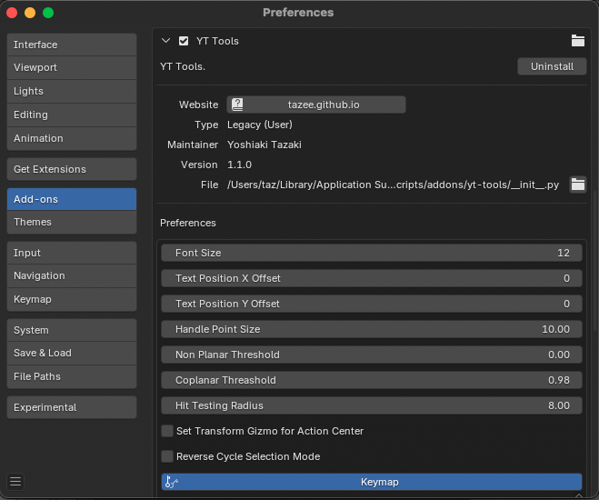

## Dimension Tool
The Dimension tool calculates a bounding box that contains the selected elements and displays its size on screen. If no elements are selected, it displays a bounding box that contains the entire active mesh.

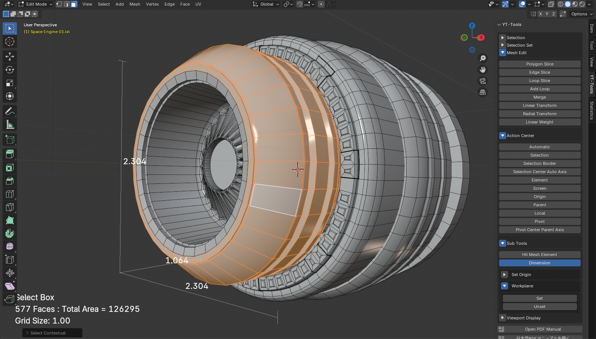

## Action Center
Action Center sets Blender's Transform Pivot Point and Transform Orientation to behave similarly to Modo's Action Center. Action Center can be set from the Action Center tab in the Sidebar. The last Action Center set is highlighted in the SideBar. Turning off a highlighted Action Center sets the default Transform Pivot Point and Transform Orientation.
### Automatic 
Automatic moves the 3D Cursor position to the selection position and sets the Pivot Point to Cursor and Orientation to Global.
### Selection 
Selection sets the Pivot Point to Median Center and Orientation to Normal.
### Selection Border 
Selection Border moves the 3D Cursor position to the center of the selected border element and sets the Pivot Point to Cursor. Orientation is set to Normal.
### Selection Center Auto Axis 
Selection Center Auto Axis sets the Pivot Point to Median Center and Orientation to Global.
### Element 
Element sets the Pivot Point to Active Element and Orientation to Normal.
### Screen 
Screen sets the Pivot Point to Active Element and Orientation to View.
### Origin 
Origin moves the 3D Cursor position to the center of the active object and sets the Pivot Point to Cursor. Orientation to Global.
### Parent 
Parent moves the 3D Cursor position to the position of the active object's parent object and sets the Pivot Point to Cursor. Orientation to Parent.
### Local 
Local sets the Pivot Point to Individual Origin and Orientation to Normal.
### Pivot 
Pivot moves the 3D Cursor position to the active object's position and sets the Pivot Point to Cursor. Orientation to Local. Local sets the Pivot Point to Individual Origin and Orientation to Normal.
### Pivot Center Parent Axis 
Pivot moves the 3D Cursor position to the position of the active object and sets the Pivot Point to Cursor. Set Orientation to Parent.

## Hit Mesh Element
Hit Mesh Element sets the position of the hit element on the mesh by clicking the mouse on the Mesh object to Active Element, 3D Cursor, or Object Origin. Once Hit Mesh Elements is executed, mouse clicks are processed as hit test events until the tool is released. If you want to continue operations such as transform tools, you must release Hit Mesh Elements once. You can release the tool by pressing the ESCAPE key, right-clicking the mouse, or pressing the Hit Mesh Elements button.

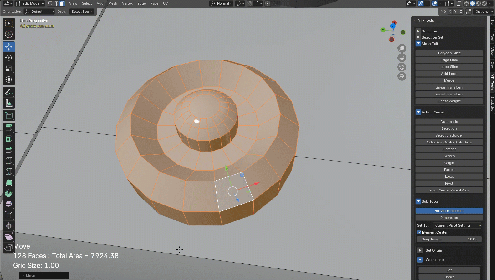

### <ins>Set To</ins> 
Select where to set the position of the hit element. 3D Cursor sets the world coordinate value of the hit position to the 3D Cursor position. Object Origin sets the world coordinate value to the object origin position (pivot position). If Active Element is selected, the hit element is set as the Active Element. Current Pivot Setting sets the Active Element if Transform Pivot Point is Active Element, otherwise it sets the 3D Cursor.
### <ins>Element Center</ins> 
When Element Center is enabled, the center position of the hit element is set as a world coordinate value instead of the clicked position on the mesh.
### <ins>Snap Range</ins> 
Specifies the allowable radius in the view coordinate system for hit testing. The hit element is determined in the order of vertices, edges, and faces within this radius from the hit position. Increasing this value makes it easier to select vertices and edges.

## Set Origin
Set Origin moves the object's origin position (position indicated by a yellow circle mark) using the specified method.
### <ins>3D Cursor</ins> 
Sets the coordinate position of the 3D Cursor to Origin.
### <ins>Selection Center</ins> 
Sets the center coordinate position of the selected element to Origin.
### <ins>Selection Border Center</ins> 
Sets the center coordinate position of the border element to Origin.
### <ins>Origin</ins> 
Sets the origin position (0,0,0) to Origin.

## Workplane
The workplane function moves the selected element to the center of the view in Edit mode and temporarily sets the normal vector of the selection to the Z-axis direction of the view, making modeling in the planar view easier. This function sets the calculated transform to convert the selection to the center of the planar view based on the selected element to an empty object created with the name "_Workplane", and parent the mesh object to be edited to this "_Workplane" object. Pressing Unset will delete this "_Workplane" object and return the parented object to its original state. This allows you to temporarily edit the mesh by setting the plane on which the mesh element you want to edit is located to the Top view. 
In addition, when you set the workplane in Object mode, a transform matrix that returns the transform of the currently selected object to the origin is set to the "_Workplane" object, and all mesh objects are parented to "_Workplane". This allows you to temporarily operate the active object at the center of the world coordinates.

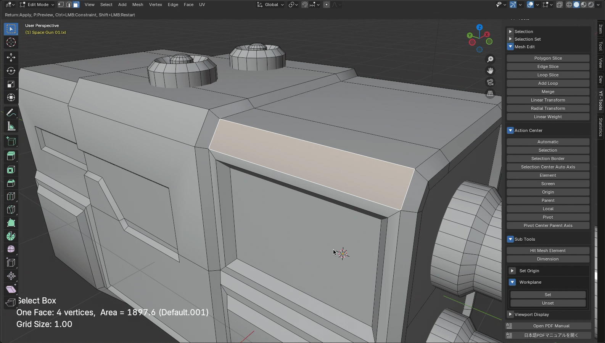

## Statistics
Statistics is an information panel that displays information on the verts, edges, and faces of a mesh by item, and allows you to select or deselect elements with those attributes. Pressing the "+" button selects the element related to that item, and pressing "-" deselects it. The number of elements displayed in the panel takes time to detect when there are a large number of polygons, so we have changed it so that you can update it manually by pressing Update Counts. If you want to display the latest information, press Update Counts. If Auto Update is enabled, the number of elements will be updated automatically. If the update speed is a problem when using a mesh with a large number of polygons, disable Auto Update.

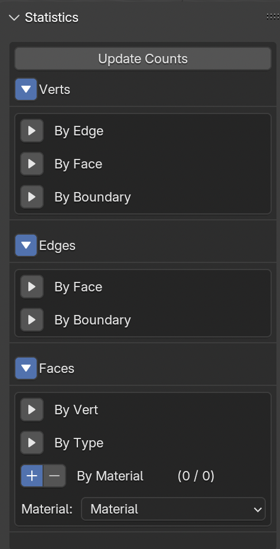

### Verts
#### <ins>By Edge</ins>
Detects Verts by the number of edges connected to each Vert.
#### <ins>By Faces</ins>
Detects verts by the number of faces that have each vert.
#### <ins>By Boundary</ins>
<b>Colinear</b> detects verts that are shared by two edges and the edges are collinear. Crease detects verts that have vertex creases on subdivision surfaces.

### Edges
#### <ins>By Face</ins>
Detects edges by the number of faces connected to each edge.
#### <ins>By Boundary</ins>
Material detects edges shared by faces with two different materials. Seam detects edges that have seam marks used in UV Unwrap. Coplanar detects edges where two connected faces have normal vectors in the same direction. Crease detects edges that have edge creases on subdivision surfaces. Sharp detects edges that have seam marks.

### Faces
#### <ins>By Vert</ins>
Detects faces by the number of verts that make up each face.
#### <ins>By Type</ins>
Non Planar detects non-planar faces. Colocalted detects overlapping faces made up of the same vertices. Coplanar detects faces with adjacent normal vectors in the same direction. Convex detects convex faces. Concave detects concave faces.

#### <ins>By Material</ins> 
Detects faces with the material selected from the list.

## Pie Menu
Another way to select Action Center items is the Action Center pie menu. This becomes available when you enable the Action Center set in the YT-Tools add-on in Preferences. The pie menu contains eight relatively frequently used Action Center operators, which are displayed when you press the assigned shortcut key.

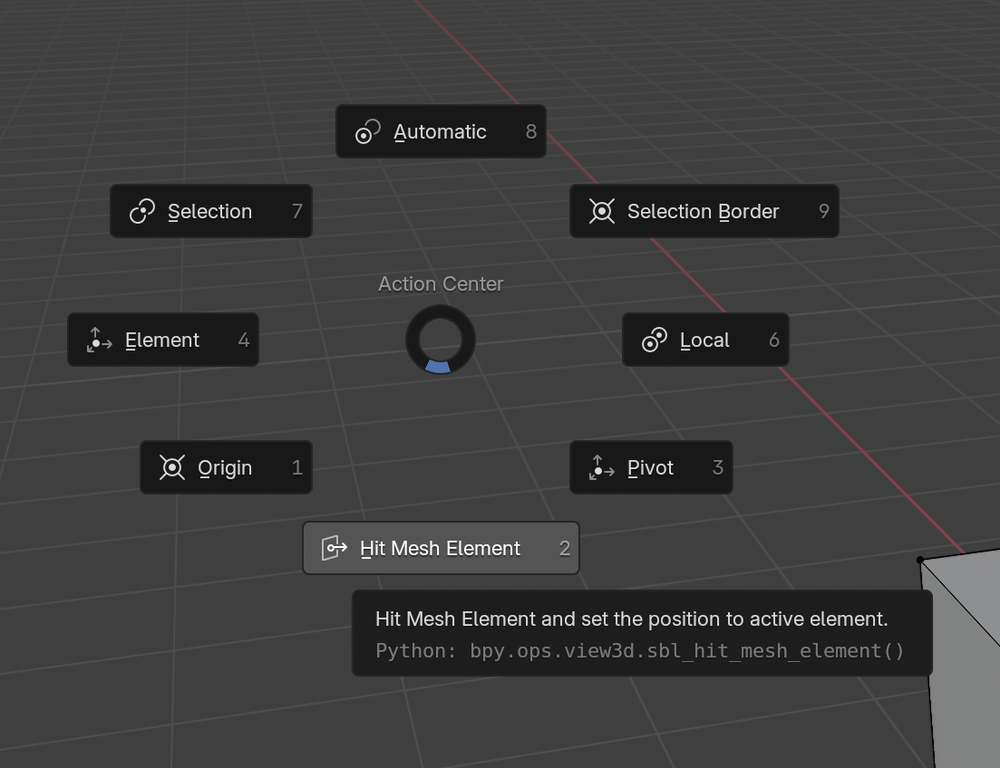

## Key Mapping
This addon assigns its own keymaps to certain operators. To change the keymap, disable the keymap you assigned in Keymaps in Preferences, or edit the keymap settings in yt-tools/addon/yt_ui_keymap.py. To register a shortcut interactively, right-click on the button of the operator you want to register to display a context menu. Select Assign Shortcut from here and press the key you want to map to register the shortcut in the '3D View' area. If you want to change the area you want to register the shortcut to 'Mesh' or 'Object', you can copy and paste the shortcut registered in Keymaps in Preferences to another area and register it again. All operators added in YT-Tools are named with the prefix "yt_", so you can easily get a list of registered shortcuts by searching for "yt_". Press Active All to enable all shortcut keys. Press Deactive All to disable all shortcut keys.

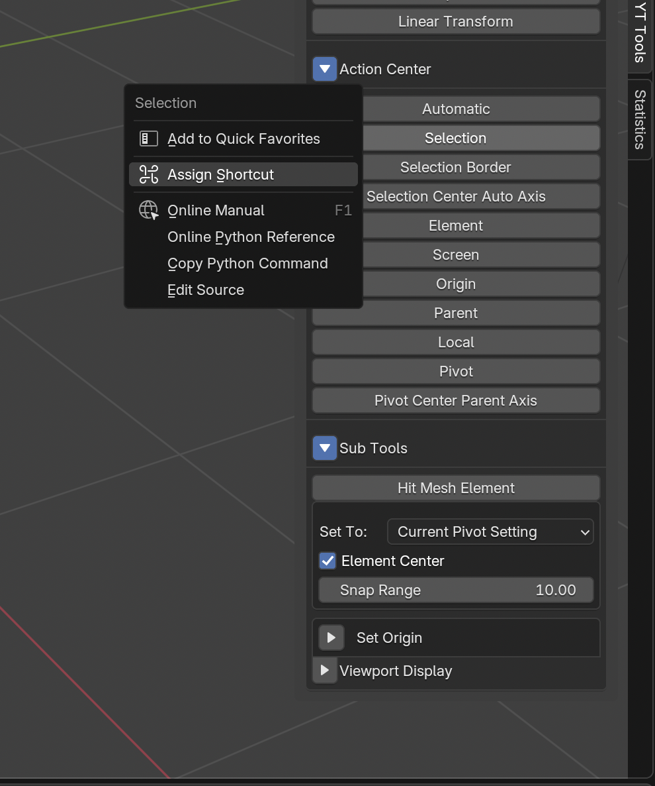

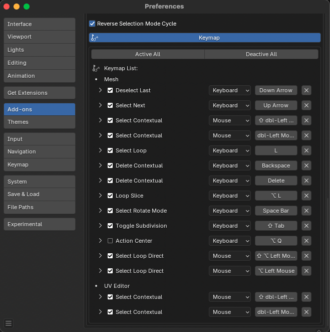

#### Up arrow (UP_ARROW) 
Select Next Element (mesh.select_next_item) 
#### Down arrow (DOWN_ARROW) 
Select Next Element (mesh.yt_deselect_last_element) 
#### Left mouse double click (LEFTMOUSE+DOUBLE_CLICK) 
Select Contextual (mesh.yt_select_contextual) 
#### Left mouse double click + SHIFT key (LEFTMOUSE+DOUBLE_CLICK+SHIFT) 
Select Contextual (additional selection) (mesh.yt_select_contextual) 
#### Delete element (DEL, BACK_SPACE) 
Delete Contextual (mesh.yt_delete_contextual) 
#### Loop Slice (Alt-L) 
Loop Slice (mesh.yt_loopslice)
#### Toggle subdivision surfaces on and off (Shift-TAB) 
Toggle Subdivision (mesh.yt_toggle_subdivision)
#### Edit Mode Cycle (SPACE) 
Select Rotate Mode (mesh.yt_select_rotate_mode) 

## Preferences
#### <ins>Font Size</ins> 
Specifies the font size of the text displayed in Display Info.
#### <ins>Handle Point Size</ins> 
Specifies the size of the point handle displayed in Polygon Slice, etc. in pixels.
#### <ins>Non Planar Threshold</ins> 
Sets the threshold used to detect non-planar in the Statistics panel.
#### <ins>Coplanar Threashold</ins> 
Sets the threshold used to detect coplanar in the Statistics panel.
#### <ins>Set Transform Gizmo for Action Center</ins> 
Sets whether to automatically set Transform Gizmo when Action Center is set.
#### <ins>Reverse Selection Mode Cycle</ins> 
Reverses the order of Edit Mode switching by the space key.

## Operator List

### Select

| Name | Operator |
|---------|------------------|
| Select Next | mesh.select_next_item |
| Deselect Last | mesh.yt_deselect_last_element |
| Convert Edge to Face | mesh.yt_select_convert_edge2face |
| Convert Vert to Face | mesh.yt_select_convert_vert2face |
| Select Boundary | mesh.yt_select_boundary |
| Select Loop | mesh.yt_select_loop |
| Select Loop Direct | mesh.yt_select_loop_direct |

### Selection Set

| Name | Operator |
|---------|------------------|
| Select | mesh.yt_selection_set_select |
| Add | mesh.yt_selection_set_select |
| Remove | mesh.yt_selection_set_remove |
| Push | mesh.yt_selection_clipboard_push |
| Pop | mesh.yt_selection_clipboard_pop |
| Clear | mesh.yt_selection_clipboard_clear |

### Action Center

| Name | Operator |
|---------|------------------|
| Automatic | view3d.yt_action_automatic |
| Selection | view3d.yt_action_selection |
| Selection Border | view3d.yt_action_selection_border |
| Selection Center Auto Axis | view3d.yt_action_selection_auto_axis |
| Element | view3d.yt_action_element |
| Screen | view3d.yt_action_screen |
| Origin | view3d.yt_action_origin |
| Parent | view3d.yt_action_parent |
| Local | view3d.yt_action_local |
| Pivot | view3d.yt_action_pivot |
| Pivot Center Parent Axis | view3d.yt_action_pivot_parent_axis |

### Sub Tools

| Name | Operator |
|---------|------------------|
| Hit Mesh Element | view3d.yt_hit_mesh_element |
| 3D Cursor | view3d.yt_origin_to_cursor |
| Selection Center | view3d.yt_origin_to_selection |
| Selection Border Center | view3d.yt_origin_to_selection_border |
| Origin | view3d.yt_origin_to_origin |
| Workplane Set | view3d.yt_workplane_set |
| Workplane Unset | view3d.yt_workplane_unset |

### Mesh Editting

| Name | Operator |
|---------|------------------|
| Loop Slice | mesh.yt_loopslice |
| Polygon Slice | mesh.yt_polyslice |
| Linear Transform | mesh.yt_transform_linear |
| Radial Transform | mesh.yt_transform_radial |
| Edge Slice | mesh.yt_edgeslice |
| Merge | mesh.yt_merge_verts |
| Linear Weight | mesh.yt_weight_linear |
| Add Loop | mesh.yt_addloop |

### Viewport Display

| Name | Operator |
|---------|------------------|
| Set Attributes | mesh.yt_viewport_display |
| Display Info | mesh.yt_viewport_text |
| Dimension | mesh.yt_dimension |

