---
# Feel free to add content and custom Front Matter to this file.
# To modify the layout, see https://jekyllrb.com/docs/themes/#overriding-theme-defaults

layout: default
permalink: /yt-tools/index_J.html
---

# YT-Tools for Blender

このアドオンは、Blenderのモデリングワークフローに便利なツールのコレクションです。主にModoユーザーがBlenderを使いやすくする目的に特化したユーティリティが含まれています。 

## Blenderバージョン

- 4.0以上、もしくはその派生バージョン
- アドオンはPythonのみで記述されており、macOS, Windowで動作します。

## インストール

BlenderのPreferencesのAdd-onsメニューからyt-tools.zipをインストールし、YT-Toolsを有効にします。

 

## 使い方

基本的な機能は、サイドバーの"YT-Tools"タブからアクセスできます。一部の機能はショートカットキーもしくはマウスクリック操作にマッピングされています。

 

## 選択機能

### <ins>Select Convert Edge to Face</ins> 

Edit Modeモードで、選択した２つ以上のEdgeを含むFaceを選択し、現在の選択モードをFaceに設定します。 

### <ins>Select Convert Vert to Face</ins> 

Edit Modeモードで、選択した３つ以上のVertを含むFaceを選択し、現在の選択モードをFaceに設定します。 

### <ins>Select Boundary</ins> 

Edit Modeモードで、選択したFaceと非選択Faceの境界にある全てEdgeを選択し、現在の選択モードをEdgeに設定します。 

### <ins>Select Next / Deselect Last</ins> （ショートカットのみ） 

Edit Modeで、２つ以上選択したFace（もしくはEdge、Vert）の選択パターンをもとに、次のエレメントを選択します。この機能は、Modoのselect.more/select.lessに該当し、キーボードの上矢印キーと下矢印キーに設定されています。下矢印キーには最後に選択されたエレメントが非選択状態になります。どちらのショートカットキーもRepeatのフラグがオンになっていますので、キーを長押しすると連続してエレメントが次々に選択されます。Select Nextには、mesh.select_next_itemというBlender標準のオペレータが使用されています。

### <ins>Select Contextual</ins> （マウスのダブルクリックのみ） 

Edit Modeで、FaceをマウスでダブルクリックするとそのFaceに連結された他のFaceが選択されます。Edgeをダブルクリックするとエッジループが選択されます。SHIFTキーを押しながらダブルクリックすると既存の選択に加えて、前述のエレメントが選択状態になります。 
<ins>制限事項：ツールハンドルを使用するオペレータは４面図ビューモードでは動作しません。これはBlenderが４面図を特殊なビューとして表示しており、アドオン側で４面図を正しく認識できないためです。</ins>

### <ins>Select Loop</ins> （ショートカットのみ） 

Edit Modeで、Modoライクな方法でFaceもしくはEdgeのループ選択を行います。Faceでは２つの連続したFaceを選択した状態でLキーを押すとそれに連なるFaceがループ上に選択されます。EdgeモードではEdgeを一つ選択し、Lキーを押すとエッジループが選択されます。

### <ins>Edit Modeの循環</ins> （ショートカットのみ） 

Edit Modeで、現在選択されている編集モードをFace, Edge, Vertの順番で巡回して切り替えます。スペースキーに割り当てられています。

### <ins>Select Loop Direct</ins> （ショートカットのみ） 

Altキー＋LMBで選択するBlender標準のループ選択と同じですが、選択されたエレメントを選択履歴に順番に登録します。これにより下矢印キーにアサインされているDeselect Lastを実行すると最後に選択されたエレメントから順番に選択されたエレメントを非選択にすることができます。

## 選択セット(Selection Set)

<b>Selection Set</b>は、Vert、Edge、Faceの選択状態を名前をつけてメッシュに保存する機能です。これらの情報はメッシュのカスタムデータとして保存されます。Blenderのシーンファイルに保存されますので、保存したシーンを再度開いた場合にも保持されています。<b>Add</b>は、現在選択されているメッシュエレメントを<b>Selection Set</b>に追加します。<b>Selection Set</b>は、Vert、Edge、Faceに対して別々に保存されます。<b>Remove</b>は、現在表示されている<b>Selection Set</b>を削除します。<b>Remove All</b>を有効にすると、現在のEditモードに対して保存されている<b>Selection Set</b>を全て削除します。<b>Select</b>は、現在表示されている<b>Selection Set</b>に保存されいるエレメントを選択状態にします。<b>Replace</b>は、現在表示されている<b>Selection Set</b>を現在の選択状態で上書きします。  
<b>Push</b>, <b>Pop</b>, <b>Clear</b>は、現在選択されているエレメントの状態を一時的に退避し、必要な時に選択状態を呼び戻す機能です。基本的には<b>Selection Set</b>と同じメカニズムを使用していますが、明示的に名前をつけて保存せずにクリップボード感覚で選択状態のプッシュ・ポップを行うことができます。この選択状態もカスタムデータとして保存していますので、必要がなくなった時は<b>Clear</b>ボタンを押して選択データを削除することをお勧めします。

 

## メッシュ編集

### <ins>Loop Slice</ins> 

Loop Sliceは、Modoのループスライスに似た動作を実現するために開発したオペレータです。このオペレータは一つのEdgeもしくは連続した２つのFaceを選択した状態で起動します。選択したEdgeのリングもしくは２つのFaceを共有するEdgeのリングをループ状にスライスします。Faceを選択した状態でオプションの<b>Selected</b>を選択すると、選択されたFaceのみがスライスされ、他の非選択状態のFaceはマスクされてスライスされません。また、このオペレータは、このツールの対称モードを設定すれば対称位置にあるループも同時にスライスします。 
**Symmetric_Cut**を有効にするとループないでスライス位置が対称に設定されます。**Preserve Curvature**を有効にすると、スライスするエッジに連結されているエッジとで作られたベジェカーブ上に、スライス位置が調整されます。**Tension**の値は、**Preserve Curvature**で調整される高さを調整したい場合に使用します。このオペレータはModoのループスライスと同様にAlt-Lのショートカットにマッピングされています。 

**Cut Positions by Spans**は、スライスの数と間隔を各スパンの比率で直接指定するモードです。例えば"1 3 1"と入力するとポリゴンループは1:3:1の比率で三分割されます。各スパンはスペース文字で区切って入力します。スパンはその総数で徐算して正規化されますので、任意のスケールの数値で入力することができます。このフィールドでスパンが入力された場合は、分割数や**Symmetic Cut**などの項目は上書きされます。

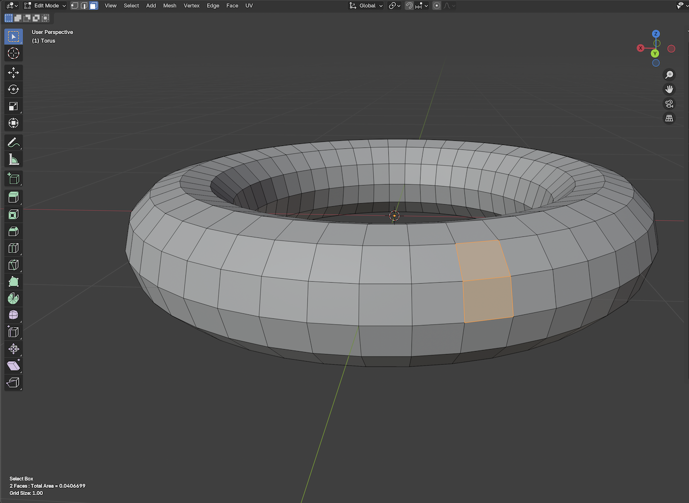

### <ins>Add Loop</ins> 

<b>Add Loop</b>は、インタラクティブバージョンのLoop Sliceで、スライスするループのエッジを直接クリックして指定します。エッジをクリックするとスライスラインが黄色の線で表示されます。クリックした位置に表示されるハンドルをドラッグするとスライス位置を変更することができます。SPACEキーを押すとスライスが確定され、ツールが終了します。Returnキーを押すとスライスが確定されますがツールは継続され、次のスライス操作を連続して行うことができます。<b>Add Loop</b>には、スライスする位置を各エッジの比率ではなく、クリックしたエッジ上の距離でスライスする<b>Absolute Distance</b>オプションがあります。このオプションを有効にするとクリックしたエッジの分割位置の距離を基準にその他のエッジが分割されます。スライスのループラインを平行に移動させたい場合に有効です。<b>Offset from End</b>を有効にするとエッジの反対側からオフセットが行われます。

### <ins>Delete Contextual</ins> （ショートカットのみ） 

Edit Modeで、Modoライクな方法で選択されいるFace、Edge、Vertを削除します。各選択モードでBackspaceキーもしくはDeleteキーを押すと選択されているエレメントが削除されます。このコマンドは3Dビュー右上で指定できる対称モードを参照しています。選択したエレメントに対称となるエレメントが存在する場合は同時にエレメントが削除されます。FaceモードではDelete Faceコマンドが実行され、Edge, VertモードではDissolve Edge, Dissolve Vertが実行されます。

### <ins>Polygon Slice</ins> 

Polygon Sliceは、Modoのポリゴンスライスに似た動作を実現するために開発したオペレータです。<b>Polygon Slice</b>ボタンを押してPolygon Sliceを起動するとマウスカーソルがナイフ形状になります。3D Viewをクリックおよびドラッグするとスライスするラインとハンドルが表示されます。スライスする軸は、X、Y、Zおよびスクリーン方向です。デフォルトはスクリーン方向で、サイドバーのAxisから変更することができます。スライスの位置は始点ハンドル、終点ハンドルおよび中心ハンドルで調整できます。Ctrlキーを押しながらハンドルをドラッグするとスクリーンの水平もしくは垂直方向にハンドルの移動を拘束することができます。Shiftキーを押しながら画面をドラッグすると最初のスライスハンドルを設定し直すことができます。スライスをメッシュに適応するには、キーボードの<b>Retrun</b>キーを押してください。このキーを押すまではメッシュはスライスされません。実行前にスライスの状態を確認するには、<b>P</b>キーを押してスライスを事前にプレビューすることができます。また、このオペレータは、このツールの対称モードを設定すれば対称位置にあるループも同時にスライスします。
 
- Ctrl + LMBクリック：スクリーンの水平もしくは垂直方向にハンドルの移動を拘束します。 
- Shift + LMBクリック：スライスラインを新しく引き直します。 
- Returnキー：スライスを確定し、メッシュを変更します。ツールは継続します。 
- Spaceキー：スライスを確定し、メッシュを変更します。ツールは終了します。 
- Pキー：プレビューを表示します。 
- ESCキー、RMBクリック：メッシュを変更せずにツールを終了します。 
<ins>制限事項：ツールハンドルの移動はBlenderがSnapに関するAPIを公開していないためスナップには対応していません。また、このオペレータは４面図ビューモードでは動作しません。これはBlenderが４面図を特殊なビューとして表示しており、アドオン側で４面図を正しく認識できないためです。</ins>

### <ins>Edge Slice</ins> 

<b>Edge Slice</b>は、ModoのEdge Sliceライクな操作性を持つインタラクティブなスライスツールで、FaceをクリックしたEdgeからEdgeの間を連続してスライスすることができます。このツールは対称をサポートしており、Edge Sliceボタンを押してツールを起動すると表示されるSymmetryオプションから対称軸を選択すると対称に位置するFaceを同時にスライスすることができます。また、FaceをまたがってEdgeが選択されたり、Face上をクリックした場合、現在操作しているビュー方向上にハンドルが追加されます。各ハンドルは追加した後で移動することができます。下記のようなオペレーションが用意されています。 
- LMBクリック：EdgeもしくはFace上をLMBでクリックすると新しくハンドルが追加されます。追加されたハンドルはLMBを押しながら移動すると位置を移動することができます。 
- Control + LMBクリック：Edge上のハンドルをControlキーを押しながらクリックするとEdge上の10%ごとの位置にスナップして位置を移動することができます。 
- Shift + LMBクリック：EdgeもしくはFaceをクリックするとそのエレメントの中心にハンドルが追加されます。 
- Spaceキー：スライスを確定し、メッシュを変更します。ツールは終了します。 
- Control + Zキー：最後に追加したハンドルを削除します。 
- ESCキー、RMBクリック：メッシュを変更せずにツールを終了します。 

### <ins>Merge</ins> 

<b>Merge</b>は、Blender標準のマージオペレータに対称の機能を加えたオペレータです。このオペレータは内部的にはbpy.ops.mesh.mergeを呼び出していて、Symmetryオプション以外はBlenderのマージオペレータと同じオプションを持ちます。詳しくはBlenderのマニュアルを参照してください。<https://docs.blender.org/manual/ja/latest/modeling/meshes/editing/mesh/merge.html>

- At Center(中心に):
残りの頂点を選択物の中央に配置します。すべての選択モードで利用できます。
- At Cursor(カーソル位置に):
残りの頂点を 3D Cursor(3Dカーソル)の位置に配置します。すべての選択モードで利用できます。
- Collapse(束ねる):
選択している頂点のすべてのアイランド(選択している辺で接続されている)は、その独自の中点でマージされ、アイランドごとに1つの頂点が残ります。
- At First(最初に選択した頂点に):
残りの頂点は、最初に選択した頂点の位置に配置します。 頂点 選択モードでのみ使用できます。
- At Last(最後に選択した頂点に):
残りの頂点は、最後に選択した頂点(アクティブな頂点)の位置に配置します。 頂点 選択モードでのみ使用できます。
- UVs(UV):
Adjust Last Operation(最後の操作を調整) パネルで、UVs(UV) がチェックされている場合、UVマッピング座標は、もしあれば、画像の歪みを避けるために補正されます。
- By Distance(距離でマージ):
選択されている頂点周囲のジオメトリをマージし、指定された距離内で選択したメッシュ頂点やポイントクラウドの点をマージします。

## ウェイト編集

### <ins>Linear Weight</ins> 

<b>Linear Weight</b>は、リニアフォールオフを使用ウェイトを設定するオペレータです。菱形で表示される線分に沿って設定されたウェイトを現在選択されているVertex Groupに設定します。アクティブなVertex Groupが存在しない場合は、新しくVertex Groupを作成し、そこにウェイト値を追加します。<b>Weight</b>は、設定するウェイト値で<b>Replace</b>は設定したウェイトで既存のウェイト値を書き換えます。<b>Additive</b>, <b>Subtract</b>は既存のウェイト値に新しい値を加算もしくは減算いたします。<b>Linear Start</b>, <b>Linear End</b>は、リニアフォールオフの始点と終点の座標値です。始点に近いほどフォールオフウェイトが大きく、終点に近づくほど減衰されて小さな移動になります。これらの位置はオペレータ起動時に現在選択されているメッシュエレメントのバウンディングボックスにフィットするように設定されます。Shiftキーを押しながら３Dビュー画面をドラックするとこのラインを新しく引き直すことができます。また、Ctrlキーを押しながらLMBをドラッグするとドラッグ方向が水平または垂直方向に拘束されます。Altキーを押しながらHaulingするとAltキーを離すまでウェイト値の適用が遅延されるため、より高速にマウス操作することができます。 
<b>Shape</b>はフォールオフの減衰計算方法を指定します。デフォルトはLinearで線形に減衰が行われます。 
<b>Reverse</b>を有効にすると<b>Linear End</b>から<b>Linear Start</b>に向かって減衰が行われます。 
<b>Mirror</b>は、フォールオフシェイプをStartもしくはEndでミラーします。フォールオフは元のフォールオフシェイプとミラーシェイプの両方から影響を与えます。 
<b>Symmetry</b>は、指定した対称軸と対称に選択されたエレメントをトランスフォームします。 
<b>Auto Fit</b>は、フォールオフシェイプを選択されているメッシュエレメントに指定した方向にフィットするようにStartとEndを移動します。 
<b>Show Axis</b>を有効にするとフォールオフシェイプのStartとEndの位置に軸ハンドルが表示されます。 
<b>Show Weight</b>は、Mesh Edit Mode OverlaysパネルにあるVertex Group Weightsを有効にし、Meshにウェイトをグラデーションカラーで表示します。 

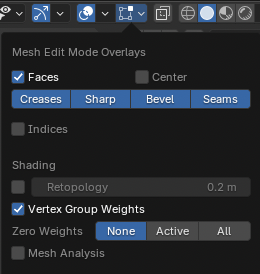

* LMBドラッグ: マウスドラッグでHaulingで設定された項目の値をHaulingで変更します。 
* LMB + Shiftドラッグ：新規にフォールオフシェイプを引き直します。 
* LMB + Control + Shiftドラッグ：新規にフォールオフシェイプを水平もしくは垂直方向に引き直します。 
* LMB + Altドラッグ：マウスボタンを放すまで変更を行いません。重いメッシュでハンドル操作を素早く位置合わせしたい場合に有効です。 
* ESCキー、Spaceキー、RMBクリック：ツールを終了します。 

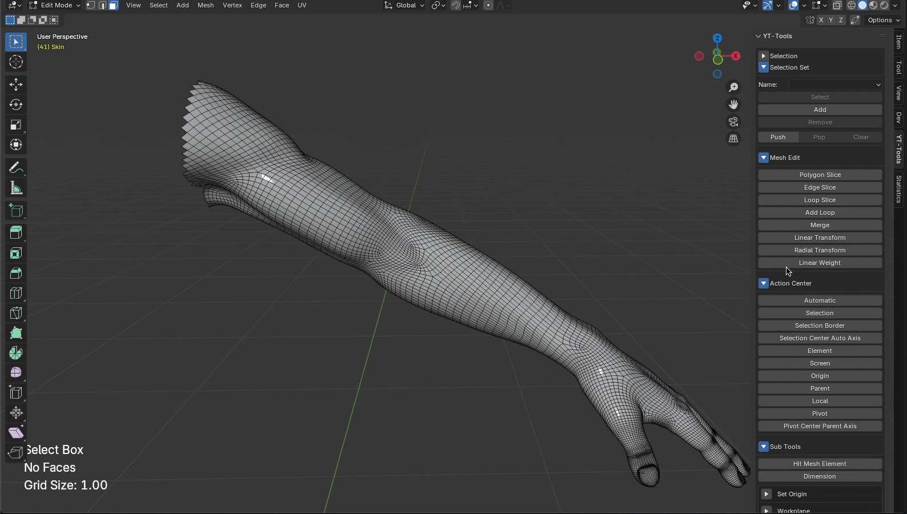

### <ins>Radial Weight</ins> 

<b>Radial Weight</b>は、ラディアルフォールオフを使用ウェイトを設定するオペレータです。球形で表示される領域内の頂点のウェイトを現在選択されているVertex Groupに設定します。アクティブなVertex Groupが存在しない場合は、新しくVertex Groupを作成し、そこにウェイト値を追加します。<b>Weight</b>は、設定するウェイト値で<b>Replace</b>は設定したウェイトで既存のウェイト値を書き換えます。<b>Additive</b>, <b>Subtract</b>は既存のウェイト値に新しい値を加算もしくは減算いたします。<b>Radial Center</b>, <b>Radial Side</b>は、ラディアルフォールオフの中心点と球体の半径です。中心点に近いほどフォールオフウェイトが小さく、中心から離れるほど大きな移動になります。球体の外側のウェイトはゼロになります。これらの位置はオペレータ起動時に現在選択されているメッシュエレメントのバウンディングボックスにフィットするように設定されます。Shiftキーを押しながら３Dビュー画面をドラックするとこの球体を新しく引き直すことができます。また、Ctrlキーを押しながらLMBをドラッグするとドラッグ方向が水平または垂直方向に拘束されます。Altキーを押しながらHaulingするとAltキーを離すまでウェイト値の適用が遅延されるため、より高速にマウス操作することができます。 
<b>Shape</b>はフォールオフの減衰計算方法を指定します。デフォルトはLinearで線形に減衰が行われます。 
<b>Invert</b>を有効にするとウェイトの減衰値を反転して適用します（w' = 1.0 - w）。 
<b>Symmetry</b>は、指定した対称軸と対称に選択されたエレメントをトランスフォームします。 
<b>Show Weight</b>は、Mesh Edit Mode OverlaysパネルにあるVertex Group Weightsを有効にし、Meshにウェイトをグラデーションカラーで表示します。 
- LMBドラッグ: マウスドラッグでHaulingで設定された項目の値をHaulingで変更します。 
- LMB + Shiftドラッグ：新規にフォールオフシェイプを引き直します。 
- LMB + サイドハンドルドラッグ：フォールオフのサイズを各軸別にリサイズします。 
- LMB + Shift + サイドハンドルドラッグ：フォールオフのサイズを全ての軸均等にリサイズします。 
- LMB + 中心ハンドルドラッグ：フォールオフ形状全体を移動します。 
- LMB + Control + サイドハンドルドラッグ：フォールオフ形状全体を移動します。 
- LMB + Altドラッグ：マウスボタンを放すまで変更を行いません。重いメッシュでハンドル操作を素早く位置合わせしたい場合に有効です。 
- ESCキー、Spaceキー、RMBクリック：ツールを終了します。 

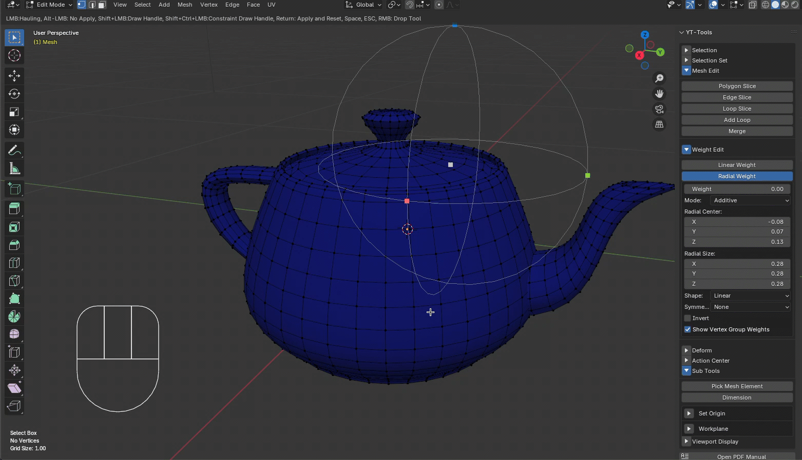

## 座標変換

### <ins>Linear Transform</ins> 

<b>Linear Transform</b>は、リニアフォールオフを使用したトランスフォームオペレータです。菱形で表示される線分に沿ってトランスフォームの度合いが減衰されます。<b>Move Offset</b>, <b>Scale</b>, <b>Angle</b>は、それぞれトランスフォームする相対的な移動量、スケール、および回転量を指定します。回転とスケールの中心は現在設定されている<b>Transform Pivot Point</b>を参照しています。<b>Transform Orientation</b>は、Normalのみに対応しています。それ以外はGlobalの方向に準じます。LMBを押しながら３Dビュー上でHaulingもしくはトランスフォームハンドルを操作するとインタラクティブにトランスフォーム値を変更することができます。Hauling操作で使用する項目は、メニューのHaulingで指定できます。また、ショートカットキーのT、R、Sに割り当てられていますので、キーボードショートカットからも変更することが可能です。<b>Linear Start</b>, <b>Linear End</b>は、リニアフォールオフの始点と終点の座標値です。始点に近いほどフォールオフウェイトが大きく、終点に近づくほど減衰されて小さな移動になります。これらの位置はオペレータ起動時に現在選択されているメッシュエレメントのバウンディングボックスにフィットするように設定されます。Shiftキーを押しながら３Dビュー画面をドラックするとこのラインを新しく引き直すことができます。また、Ctrlキーを押しながらLMBをドラッグするとドラッグ方向が水平または垂直方向に拘束されます。 
<b>Shape</b>はフォールオフの減衰計算方法を指定します。デフォルトはLinearで線形に減衰が行われます。 
<b>Reverse</b>を有効にすると<b>Linear End</b>から<b>Linear Start</b>に向かって減衰が行われます。 
<b>Mirror</b>は、フォールオフシェイプをStartもしくはEndでミラーします。フォールオフは元のフォールオフシェイプとミラーシェイプの両方から影響を与えます。 
<b>Symmetry</b>は、指定した対称軸と対称に選択されたエレメントをトランスフォームします。 
<b>Auto Fit</b>は、フォールオフシェイプを選択されているメッシュエレメントに指定した方向にフィットするようにStartとEndを移動します。Orient:は、リニアハンドルをフィットする方向を指定します。XYZはそれぞれ主軸方向にハンドルを移動します。Oriented Bounding Boxは方向性バウンディングボックスを計算しハンドルをその軸方向にフィットします。 
<b>Show Axis</b>を有効にするとフォールオフシェイプのStartとEndの位置に軸ハンドルが表示されます。 
- G, R, S キー: 移動、回転、スケールの切り替え 
- LMBドラッグ: マウスドラッグでHaulingで設定された項目の値をHaulingで変更します。 
- LMB + Shiftドラッグ：新規にフォールオフシェイプを引き直します。 
- LMB + Control + Shiftドラッグ：新規にフォールオフシェイプを水平もしくは垂直方向に引き直します。 
- LMB + Altドラッグ：マウスボタンを放すまで変更を行いません。重いメッシュでハンドル操作を素早く位置合わせしたい場合に有効です。 
- Returnキー：変更を確定し、変更値をリセットします。
- ESCキー、Spaceキー、RMBクリック：ツールを終了します。 

### <ins>Radial Transform</ins> 

<b>Radial Transform</b>は、ラディアルフォールオフを使用したトランスフォームオペレータです。円環状の形状の中でトランスフォームの度合いが減衰されます。<b>Move Offset</b>, <b>Scale</b>, <b>Angle</b>は、それぞれトランスフォームする相対的な移動量、スケール、および回転量を指定します。回転とスケールの中心は現在設定されている<b>Transform Pivot Point</b>を参照しています。<b>Transform Orientation</b>は、Normalのみに対応しています。それ以外はGlobalの方向に準じます。LMBを押しながら３Dビュー上でHaulingもしくはトランスフォームハンドルを操作するとインタラクティブにトランスフォーム値を変更することができます。Hauling操作で使用する項目は、メニューのHaulingで指定できます。また、ショートカットキーのT、R、Sに割り当てられていますので、キーボードショートカットからも変更することが可能です。<b>Radial Center</b>, <b>Radial Side</b>は、ラディアルフォールオフの中心点と球体の半径です。中心点に近いほどフォールオフウェイトが小さく、中心から離れるほど大きな移動になります。球体の外側のウェイトはゼロになります。これらの位置はオペレータ起動時に現在選択されているメッシュエレメントのバウンディングボックスにフィットするように設定されます。Shiftキーを押しながら３Dビュー画面をドラックするとこの球体を新しく引き直すことができます。また、Ctrlキーを押しながらLMBをドラッグするとドラッグ方向が水平または垂直方向に拘束されます。 
<b>Shape</b>はフォールオフの減衰計算方法を指定します。デフォルトはLinearで線形に減衰が行われます。 
<b>Symmetry</b>は、指定した対称軸と対称に選択されたエレメントをトランスフォームします。 
<b>Invert</b>は、フォールオフウェイト値を反転します（w = 1.0 - w）。 
- G, R, S キー: 移動、回転、スケールの切り替え 
- LMBドラッグ: マウスドラッグでHaulingで設定された項目の値をHaulingで変更します。 
- LMB + Shiftドラッグ：新規にフォールオフシェイプを引き直します。 
- LMB + サイドハンドルドラッグ：フォールオフのサイズを各軸別にリサイズします。 
- LMB + Shift + サイドハンドルドラッグ：フォールオフのサイズを全ての軸均等にリサイズします。 
- LMB + 中心ハンドルドラッグ：フォールオフ形状全体を移動します。 
- LMB + Control + サイドハンドルドラッグ：フォールオフ形状全体を移動します。 
- LMB + Altドラッグ：マウスボタンを放すまで変更を行いません。重いメッシュでハンドル操作を素早く位置合わせしたい場合に有効です。 
- Returnキー：変更を確定し、変更値をリセットします。
- ESCキー、Spaceキー、RMBクリック：ツールを終了します。 

### <ins>Bend Transform</ins> 

<b>Bend Transform</b>は、Modoのベンドツールに似た機能を持つトランスフォームツールです。選択されている頂点の座標値をベンドのスパインハンドルを軸に湾曲させます。<b>Center</b>は、ベンドの中心位置でこの位置を中心にベンドが行われます。<b>Spine</b>は、湾曲を行う軸となるベクトルです。<b>Axis</b>は、ベンドを行う平面を定義するオプションで、XYZの主軸もしくは現在操作しているビュー方向を設定することができます。選択されているエレメントの法線ベクトル方向を指定したい場合は、作業平面を使って操作することができます。<b>Angle</b>は、ベンドする量を角度で指定します。この値は、白い円形のハンドルを操作して変更することができます。 
<b>Both Sides</b>は、スパインベクトルと反対方向に位置する頂点の座標も変形します。 
<b>Symmetry</b>は、指定した対称軸と対称に選択されたエレメントをトランスフォームします。 
- LMB + Shiftドラッグ：新規にフォールオフシェイプを引き直します。 
- LMB + スパインハンドルドラッグ：スパインの終点位置を変更します。 
- LMB + 中心ハンドルドラッグ：スパインの始点位置を変更します。 
- LMB + Shift + スパインハンドルドラッグ：スパインベクトルの長さをリサイズします。 
- LMB + 回転ハンドルドラッグ：ベンドアングル量を変更します。 
- LMB + Control + ハンドルドラッグ：スクリーンの水平もしくは垂直方向に移動を制限します。 
- LMB + Altドラッグ：マウスボタンを放すまで変更を行いません。重いメッシュでハンドル操作を素早く位置合わせしたい場合に有効です。 
- Returnキー：変更を確定し、変更値をリセットします。
- ESCキー、Spaceキー、RMBクリック：ツールを終了します。 

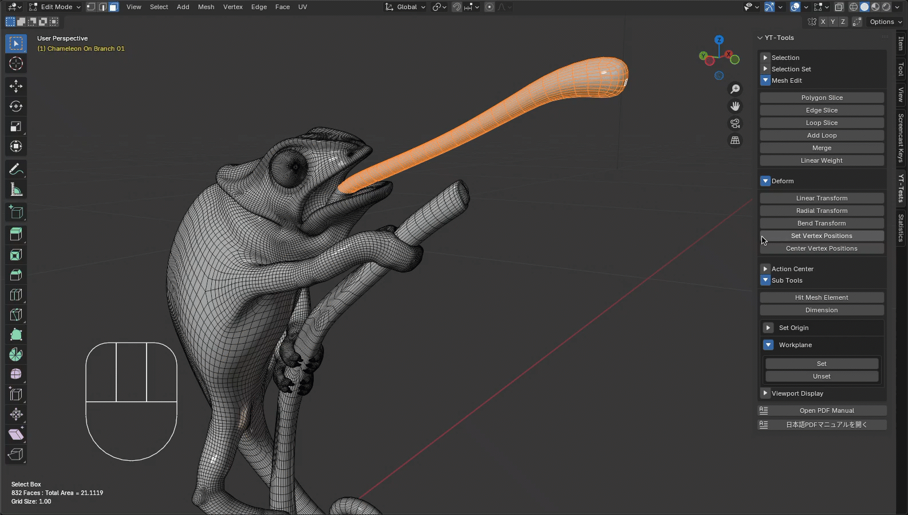

<b>Reverse</b>は、スパインベクトルの方向を反転します。 
<b>Auto Fit</b>は、スパインハンドルを選択されているメッシュエレメントに指定した方向にフィットするように移動します。<b>Orient:</b>は、スパインハンドルをフィットする方向を指定します。XYZはそれぞれ主軸方向にハンドルを移動します。<b>Oriented Bounding Box</b>は方向性バウンディングボックスを計算しハンドルをその軸方向にフィットします。<b>Spine Only</b>を有効にするとスパインの中心位置は移動せずにスパインベクトルの長さだけを計算したバウンディングボックスにフィットするように変更します。 

### <ins>Soft Drag</ins> 

<b>Soft Drag</b>は、クリックしたスクリーン上のポイントを中心にサイズで指定した半径内にある頂点の座標値をスムースに移動するトランスフォームツールです。<b>Size</b>はスクリーン上のフォールオフ円の半径で、RMBをドラッグするとインタラクティブに変更する事ができます。LMBで変形を行いたい場所をクリックしてドラッグするとフォールオフの円形内にある頂点が移動します。Shiftキーを押しながらLMBでドラッグするとフォールオフ内の頂点座標のスムージングを行います。これはスムースブラシと同じ処理です。 
<b>Soft Drag</b>は、メッシュの頂点だけでなく、UVマップのポイントも編集することができます。UVエディタ上に表示されているUVマップを3Dビューと同じ操作で編集することができます。 
<b>Occlusion Test</b>は、対象となる頂点が他のポリゴンの後ろに隠れているかどうかをテストし、隠れている頂点は移動しません 
<b>Smooth Strength</b>は、スムースブラシで行うスムージングの強さを設定します。 
<b>Symmetry</b>は、指定した対称軸と対称に選択されたエレメントをトランスフォームします。 
- RMBドラッグ：フォールオフの円のサイズを変更します。 
- LMB + Shiftドラッグ：頂点座標値の平滑化を行います。 
- LMB + Altドラッグ：マウスボタンを放すまで変更を行いません。重いメッシュでハンドル操作を素早く位置合わせしたい場合に有効です。 
- ESCキー、Spaceキー：ツールを終了します。 

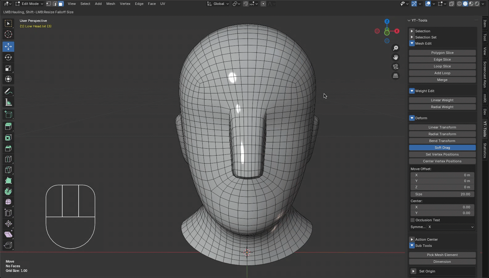

### <ins>Smooth Brush</ins> 

<b>Smooth Brush</b>は、ブラッシング操作でカーソル周辺の半径内にある頂点の座標値をスムージングするトランスフォームツールです。<b>Size</b>はスクリーン上のフォールオフ円の半径で、RMBをドラッグするとインタラクティブに変更する事ができます。LMBでスムージングしたい頂点の周辺をドラッグするとフォールオフの円形内にある頂点が平滑化されます。 
<b>Occlusion Test</b>は、対象となる頂点が他のポリゴンの後ろに隠れているかどうかをテストし、隠れている頂点は移動しません 
<b>Smooth Strength</b>は、スムースブラシで行うスムージングの強さを設定します。 
<b>Symmetry</b>は、指定した対称軸と対称に選択されたエレメントをトランスフォームします。 
- RMBドラッグ：フォールオフの円のサイズを変更します。 
- LMB + Altドラッグ：マウスボタンを放すまで変更を行いません。重いメッシュでハンドル操作を素早く位置合わせしたい場合に有効です。 
- ESCキー、Spaceキー：ツールを終了します。 

### <ins>Set Vertex Positions</ins> 

<b>Set Vertex Positions</b>は、選択した頂点の座標値を指定した値に設定します。<b>Axis</b>は、設定する座標値のコンポーネントで、有効になっている軸の座標値のコンポーネントのみが更新されます。<b>Position</b>は、設定する座標値で、アクティブ頂点の座標値がデフォルト値としてセットされます。アクティブ頂点がない場合は、選択した頂点座標値の中心値がセットされます。<b>Space</b>は、座標値をメッシュのローカル座標値で設定するか、オブジェクトのグローバル座標値で設定するかを指定します。<b>Mode</b>は、指定したPositionの値を既存の頂点の値と置き換えるか（SET)、追加するか（ADD)を指定します。 

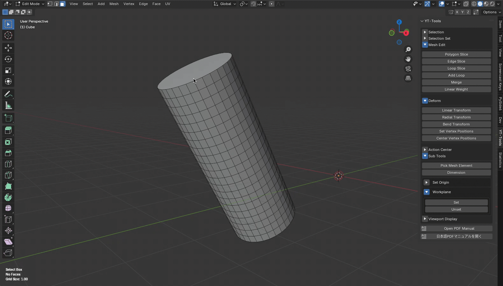

### <ins>Center Vertex Positions</ins> 

<b>Center Vertex Positions</b>は、選択した頂点の座標値を選択した頂点を包含するバウンディングボックスの中心値に設定します。<b>Axis</b>は、設定する座標値のコンポーネントで、有効になっている軸の座標値のコンポーネントのみが更新されます。<b>Space</b>は、座標値をメッシュのローカル座標値で設定するか、オブジェクトのグローバル座標値で設定するかを指定します。 

### <ins>絶対スケール</ins> 
絶対スケーリングを使用すると、メッシュの寸法を決定し、均一に、明示的に、または正確な数値を使用してメッシュの寸法を基準にして再スケーリングできます。メッシュアイテムを作成した後でも、スケールツールをドラッグするか、スケール X/Y/Z チャンネルを調整することで再スケーリングできます。 
サイズを取得： 
このコマンドは、実際のバウンディングボックスのサイズを取得し、「均一」および「明示的」データフィールドに入力して、選択範囲のサイズ設定の基準点とします。「選択範囲に合わせて方向設定」を有効にすると方向性バウンディングボックスから計算した軸方向とサイズに基づいてスケールを行います。 
<b>均一：</b> 
「均一スケール」オプションを使用すると、選択範囲のすべての軸を 1 ステップで均一にスケーリングできます。使用するには、まず「サイズを取得」コマンドを選択します。このコマンドは、最長軸の長さを取得し、「均一」値入力フィールドに基準点として挿入します。次に、デフォルトのバウンディングボックスの中心以外の場所にスケーリングの中心を設定する場合は、中心を選択します。「均一」入力フィールドに新しい明示的な値を入力します。 「均一軸」で、スケールする軸を絶対的に定義し、「均一スケール」ボタンをクリックしてスケール操作を実行します。 
<b>明示的：</b> 
「明示的スケール」オプションを使用すると、選択要素のバウンディングボックスのサイズを指定できます。このオプションを使用するには、まず「サイズを取得」コマンドを選択します。これにより、選択範囲全体のバウンディングボックスのボリュームサイズが取得されます。次に、デフォルトのバウンディングボックスの中心以外のサイズを指定する場合は、スケールの中心を選択します。X、Y、Zの各入力フィールドに新しいサイズ値を入力し、「明示的スケール」オプションをクリックすると、オブジェクトが指定のサイズにスケールされます。 
<b>スケールの中心：</b> 
選択領域をスケールする場合、これらの値はドロップダウンリストで定義されたスケール操作の原点を定義します。「低」オプションは軸の負の端側を定義し、「中心」はすべての頂点の平均中心位置を指します。「高」は、軸の正の値に最も近いバウンディングボックスの側です。 

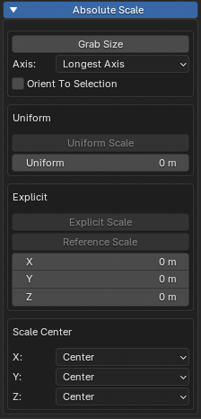

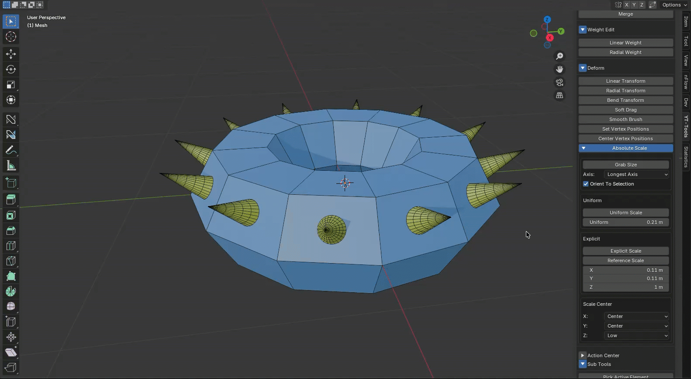

## メッシュオブジェクトの表示属性の変更（Viewport Display）

Viewport Displayは、選択されているメッシュオブジェクトと非選択のメッシュオブジェクトのビューポート表示属性を一括して変更する機能です。BlenderではメッシュオブジェクトのプロパティにViewport Displayがあり、個々のオブジェクトに対して設定可能ですが、この属性を一括して設定します。Active Meshesでは、選択されているメッシュオブジェトのための表示属性を設定し、Inactive Meshesでは非選択のメッシュオブジェトのための表示属性を設定します。Set Only Active Meshesを有効にして、Set Attributesボタンを押すと非選択のメッシュオブジェクトには変更は加えず、選択されているメッシュオブジェクトの表示属性だけを変更します。

## 表示情報（Display Info）

Display Infoを有効にすると３Dビューポート左下に下記のような情報がテキストで表示されます。 

### ツール名称 

現在選択されているツール名称が表示されます。

## エレメント情報 

Edit Modeで選択されているFace、Edge、Vertの選択数もしくは単一エレメントの情報が表示されます。Vertが一つ選択されている場合は、頂点のローカル座標値が表示されます。Edgeが一つ選択されている場合はエッジの長さが表示されます。複数のEdgeが選択されている場合は選択されているEdgeの長さの合計値が表示されます。Faceが一つ選択されている場合は、そのFaceの頂点数とアサインされているマテリアル名称および面積が表示されます。複数のFaceが選択されている場合は選択されているFaceの面積の合計値が表示されます。

## グリッドサイズ 

Viewport Overlaysパネルで設定されているGridのスケールを表示します。

## FPSゲージ 
FPSゲージを有効にすると3Dビューの描画速度をカラーゲージとFPS(Frame Per Seconde)で表示することができます。

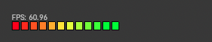

PreferencesパネルのYT-Toolsのタブでこの表示情報に使用するフォントのサイズを変更することができます。この情報は初期設定値として保存されますので、シーンファイルに共通の設定値として恒久的に使用されます。

## 寸法ツール(Dimension)

寸法ツールは選択されているエレメントを包含する境界ボックスを計算し、そのサイズを画面上に表示します。エレメントが選択されていない場合は、アクティブメッシュ全体を包含する境界ボックスが表示されます。

## アクションセンター(Action Center)

アクションセンターは、BlenderのTransform Pivot PointとTransform OrientationをModoのアクションセンターと近い動作になるように設定します。アクションセンターはサイドバーのAction Centerタブから設定できます。SideBarでは最後にセットしたアクションセンターがハイライト表示されます。ハイライトされているアクションセンターをオフにするとデフォルトのTransform Pivot PointとTransform Orientationがセットされます。Pivot Point, Orientationを別々に指定したい場合は、Pivot Point, Orientationのトグルボタンを使用します。トグルボタンがオフになっているPivot PointもしくはOrientationはセットされません。

### Automatic 

Automaticは、選択位置に3D Cursor位置を移動し、Pivot PointをCursorにOrientationをGlobalに設定します。

### Selection 

Selectionは、Pivot PointをMedian Centerに設定し、OrientationはNormalに設定します。

### Selection Border 

Selection Borderは、選択されている境界エレメントの中心を3D Cursor位置を移動し、Pivot PointをCursorに設定します。OrientationはNormalに設定します。

### Selection Center Auto Axis 

Selection Center Auto Axisは、Pivot PointをMedian Centerに設定し、OrientationはGlobalに設定します。

### Element 

Elementは、Pivot PointをActive Elementに設定し、OrientationはNormalに設定します。

### Screen 

Screenは、Pivot PointをActive Elementに、OrientationはViewに設定します。

### Origin 

Originは、アクティブオブジェクトのセンターに3D Cursor位置を移動し、Pivot PointをCursorに設定します。OrientationはGlobalに設定します。

### Parent 

Parentは、アクティブオブジェクトの親オブジェクトの位置に3D Cursor位置を移動し、Pivot PointをCursorに設定します。OrientationはParentに設定します。

### Local 

Localは、Pivot PointをIndivisual Originに設定し、OrientationはNormalに設定します。

### Pivot 

Pivotは、アクティブオブジェクトの位置に3D Cursor位置を移動し、Pivot PointをCursorに設定しますOrientationはLocalに設定します。
Localは、Pivot PointをIndivisual Originに設定し、OrientationはNormalに設定します。

### Pivot Center Parent Axis 

Pivotは、アクティブオブジェクトの位置に3D Cursor位置を移動し、Pivot PointをCursorに設定しますOrientationはParentに設定します。

## アクティブエレメントの設定(Pick Active Element)

Pick Active Elementは、Meshオブジェクトをマウスでクリックし、ヒットしたメッシュ上のエレメントの位置を、Active Element、3D CursorもしくはObject Originに設定します。Pick Mesh Elementsは、一度実行’するとツールを解除するまで、マウスクリックはヒットテストのイベントとして処理されます。トランスフォームツールなどの操作を続行する場合は、Pick Mesh Elementsを一旦解除する必要があります。ESCAPEキー、マウスの右クリック、Pick Mesh Elementsボタンを押すことでツールを解除することができます。

### <ins>Set To</ins> 

ヒットしたエレメントの位置をどこに設定するかを選択します。3D Cursorは、ヒットした位置のワールド座標値を3D Cursor位置に設定します。Object Originは、ワールド座標値をオブジェクト原点位置（ピボット位置）に設定します。Active Elementを選択した場合は、ヒットしたエレメントをActive Elementととして設定します。Current Pivot Settingは、Transform Pivot PointがActive Elementの場合は、Active Elementに、それ以外の場合は3D Cursorを設定します。

### <ins>Element Center</ins> 

Element Centerを有効にするとクリックしたメッシュ上の位置の代わりに、ヒットしたエレメントの中心位置をワールド座標値として設定します。

### <ins>Snap Range</ins> 

ヒットテスティングにおける許容半径をビュー座標系で指定します。ヒットテストはヒットした位置からこの半径内にある頂点、エッジ、面の順番でヒットエレメントが決定されます。この値を大きくすると頂点やエッジが選択されやすくなります。

## オブジェクト原点位置の設定(Set Origin)

Set Originは、指定した方法でオブジェクトの原点位置（黄色い丸いマークで示される位置）を移動します。

### <ins>3D Cursor</ins> 

3D Cursorの座標位置をOriginに設定します。

### <ins>Selection Center</ins> 

選択されているエレメントの中心座標位置をOriginに設定します。

### <ins>Selection Border Center</ins> 

境界エレメントの中心座標位置をOriginに設定します。

### <ins>Origin</ins> 

原点位置（0, 0, 0）をOriginに設定します。

## 作業平面(Workplane)

作業平面はEditモードで選択したエレメントをビューの中心に移動および選択の法線ベクトルをビューのZ軸方向へ一時的に設定し、平面ビューでのモデリング作業を容易にする機能です。この機能は選択したエレメントをもとに選択を平面ビューの中心に変換するために計算したトランスフォームを"_Workplane"という名前で作成したEmptyオブジェクトに設定し、編集するメッシュオブジェクトをこの"_Workplane"オブジェクトにペアレンティングします。<b>Unset</b>を押すとこの"_Workplane"オブジェクトは削除され、ペアレンティングされているオブジェクトはもとに戻ります。これにより一時的に編集したいメッシュエレメントが置かれている平面をTopビューにしてメッシュを編集することが可能になります。 
また、Objectモードで作業平面を<b>Set</b>すると現在選択されているオブジェクトのトランスフォームを原点に戻すトランスフォームマトリックスが"_Workplane"オブジェクトに設定され、すべてのメッシュオブジェクトが"_Workplane"にペアレンティングされます。これによりアクティブオブジェクトを一時的にワールド座標の中心にした操作が可能になります。 
<b>Set Transform Orientations</b>は、作業平面の回転マトリックスを名称をつけてカスタムTransform Orientationsに設定します。平面ビューではなくパースペクティブビューでトランスフォーム操作をしたい場合などに便利です。 
<b>Cursor Aligned to Selected</b>は、作業平面の回転マトリックスを名称をTransform OrientationsのCursorに、位置座標をTransform Pivot Positionの3D Cursorに設定します。

## スナッピング(Snapping)

インタラクティブなオペレータのツールハンドルはスナッピングをサポートしています。BlenderのSnapのオン・オフ状態とパネルで設定されている下記の項目を参照しています。

### <ins>Snap Target</ins> 

Increment, Grid, Vertex, Edge, Face, Edge Center, Edge Perpendicularに対応しています。Vertexではメッシュの頂点およびカーブの制御点にスナップします。

### <ins>Target Selection</ins> 

<b>Include Active</b>がオフの時にはアクティブオブジェクトのエレメントにはスナップしません。

### <ins>Affect</ins> 

Move, Rotate, Scaleに対応しています。

### <ins>Rotation Increment</ins> 

標準のインクリメンタル角度を参照します。

## クリップボード(Clipboard)

メッシュエレメント(Vert/Edge/Face)のコピー・カット・ペーストを行うクリップボードがサブツールに用意されています。エレメントを選択し、コピーボタンを押すと選択したエレメントがクリップボードの内部メッシュに保存されます。保存されたエレメントはペーストボタンを押すことで、現在のアクティブメッシュに貼り付けることができます。なにも選択せずにコピーボタンを押すとアクティブメッシュの全てのエレメントがクリップボードにコピーされます。カットボタンはメッシュエレメントをコピーしたのち、選択されているエレメントをアクティブメッシュから削除します。頂点モードでコピーを行うとメッシュの頂点だけがクリップボードに保存されます。エッジモードの場合は、メッシュを構成するエッジだけがワイヤーフレームのようにコピーされます。 
v1.5.1からカーブのスプラインもコピー＆ペーストできるように更新いたしました。 
<b>New Object from Clipbord</b>は、クリップボードに保存されているデータを新規に作成したオブジェクトに貼り付けます。 
クリップボードでは下記のような属性もコピー＆ペーストします。 
- マテリアル
- UVマップ、頂点カラー、シェイプキー
- エッジクリース、スムース、シーム、Freestyle
- 頂点ウェイト(頂点グループ)
- 選択セット
 

***メッシュの置き換え*** 
**メッシュの置き換え** を有効にすると、クリップボードからデータを貼り付ける前に、貼り付け先のメッシュが削除されます。 

***マテリアルの置き換え*** 
**マテリアルの置き換え** を有効にすると、貼り付け先のメッシュに同じ名前のマテリアルが存在する場合、マテリアルが上書きされます。**マテリアルの置き換え** が無効になっている場合、マテリアルは変更されません。 

***トランスフォームのインポート*** 
**トランスフォームのインポート** を有効にすると、オブジェクトの移動、回転、スケール、およびペアレント化のデータが、貼り付け先のオブジェクトのトランスフォームに設定されます。このオプションは、**クリップボードから新規メッシュ** コマンドでのみ使用できます。 

## 外部クリップボード(External Clipboard)

**External Clipboard**は、BlenderとModoおよびLightWaveの間でメッシュデータを交換することを可能にします。
**Use External Clipboard**を有効にするとコピーしたメッシュデータは、アドオン内部のキャッシュではなく**Type**で指定した外部のクリップボードに出力されます。ModoClipboardキットを使用することによって、ModoとBlenderの間でこの外部クリップボードを経由してメッシュデータの交換を行うことができます。メッシュデータはJSONフォーマットのテキストデータに変換され、外部クリップボードに出力されます。外部クリップボードの**Type**は、一時ファイルがデフォルトになっていますが、OS Clipboardを指定するとOSが提供するクリップボードにJSONテキストを保存します。出力したデータを確認したり、ファイルとして保存したりする場合に便利です。Blender側から出力されるメッシュ情報は上記の項目とほぼ同じです。Modo側で入力可能なデータに関してはModoClipboardキットのドキュメントを参照してくだい。ModoClipbordキットは、[Gumroad](https://tazaki.gumroad.com/)もしくは[Github](https://github.com/tazee/ModoClipboard)サイトから入手することができます。

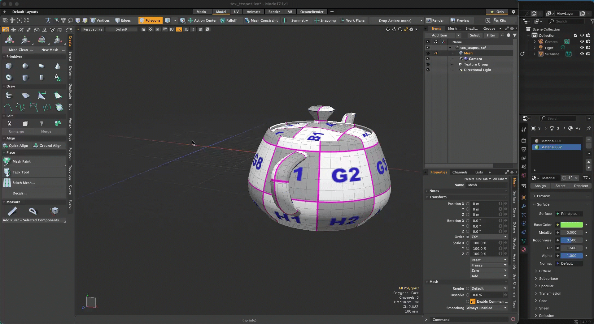

## 情報パネル(Statistics)

Statisticsは、MeshのVert、Edge、Faceの情報を項目別に表示し、その属性を持つエレメントを選択もしくは非選択にすることができる情報パネルです。"+"ボタンを押すとその項目に関するエレメントが選択され、"-"を押すと非選択になります。パネルに表示されるエレメント数の表示はポリゴン数が多くなると検出に時間がかかるため、<b>Update Counts</b>を押して手動で更新してもらうように変更いたしました。情報を最新の状態で表示させたい場合は、<b>Update Counts</b>を押してください。<b>Auto Update</b>が有効になっている場合は、自動的にエレメント数の更新が行われます。ポリゴン数が多いメッシュを使用する場合などで更新速度が問題になる場合は、<b>Auto Update</b>を無効にしてください。

### Verts

#### <ins>By Edge</ins>

各Vertに連結されているEdgeの数でVertを検出します。

#### <ins>By Faces</ins>

各Vertを持つFaceの数でVertを検出します。

#### <ins>By Boundary</ins>

<b>Colinear</b>は、2つのEdgeによって共有されていて、それらのEdgeが同一直線上にあるVertを検出します。<b>Crease</b>は、サブディビジョンサーフェイスの頂点クリースを持つVertを検出します。

### Edges

#### <ins>By Face</ins>

各Edgeに連結されているFaceの数でEdgeを検出します。

#### <ins>By Boundary</ins>

<b>Material</b>は、2つ別々のマテリアルを持つFaceに共有されているEdge検出します。<b>Seam</b>は、UV Unwrapで使用するSeamマークを持つEdgeを検出します。<b>Coplanar</b>は、連結されいる２つのFaceが同一方向の法線ベクトルを持つEdgeを検出します。<b>Crease</b>は、サブディビジョンサーフェイスのエッジクリースを持つEdgeを検出します。<b>Sharp</b>は、Seamマークを持つEdgeを検出します。

### Faces

#### <ins>By Vert</ins>

各Faceを構成するVertの数でFaceを検出します。

#### <ins>By Type</ins>

<b>Non Planar</b>は、非平面Faceを検出します。<b>Colocalted</b>同じ頂点で構成される重なって作られたFaceを検出します。<b>Coplanar</b>は、隣接するFaceが同一方向の法線ベクトルを持つFaceを検出します。<b>Convex</b>凸型のFaceを検出します。<b>Concave</b>凹型のFaceを検出します。

#### <ins>By Material</ins>

リストから選択したマテリアルを持つFaceを検出します。

## パイメニュー

アクションセンターの項目の選択を行うもう一つの方法としてアクションセンターのパイメニューが用意されています。これはプリファレンスのYT-Toolsアドオンに設定されている<b>Action Center</b>を有効にすると利用可能になります。パイメニューには比較的使用頻度の高い、アクションセンターのオペレータが８つ登録されていて、アサインされたショートカットキーを押すと表示されます。

## キーマッピング

このアドオンでは、特定のオペレータに対して、独自にキーマップを割り当てています。キーマップの変更は、PreferencesのKeymapsで独自に割り当てたキーマップを無効にするか、yt-tools/addon/yt_ui_keymap.pyに記述されているキーマップの設定を編集してお使いください。また、インタラクティブにショートカットを登録するには、登録したいオペレータのボタン上でマウスの右ボタンを押すとコンテキストメニューが表示されます。ここからAssign Shortcutを選択し、マップしたいキーを押せばショートカットが'3D View'エリアに登録されます。ショートカットを登録したいエリアを'Mesh'や'Object'に変更したい場合は、プリファレンスのKeymapsに登録されているショートカットを別のエリアにコピーペーストして登録し直すことができます。SBL ModelingToolsで追加したオペレータは全て"yt_"という接頭子をつけて命名されていますので、"yt_"で検索すれば簡単に登録されているショートカットの一覧を得ることができます。<b>Active All</b>を押すと全てのショートカットキーが有効になります。<b>Deactive All</b>を押すと全てのショートカットキーが無効になります。

#### 上矢印（UP_ARROW） 

Select Next Element (mesh.select_next_item) 

#### 下矢印（DOWN_ARROW） 

Select Next Element (mesh.yt_deselect_last_element) 

#### 左マウスダブルクリック（LEFTMOUSE+DOUBLE_CLICK） 

Select Contextual (mesh.yt_select_contextual) 

#### 左マウスダブルクリック+SHIFTキー（LEFTMOUSE+DOUBLE_CLICK+SHIFT） 

Select Contextual (追加選択) (mesh.yt_select_contextual) 

#### エレメントの削除（DEL, BACK_SPACE） 

Delete Contextual (mesh.yt_delete_contextual) 

#### ループスライス (Alt-L) 

Loop Slice (mesh.yt_loopslice) 

#### サブディビジョンサーフェイスのオン・オフの切り替え (Shift-TAB) 

Toggle Subdivision (mesh.yt_toggle_subdivision) 

#### Edit Modeの循環 (SPACE) 

Select Rotate Mode (mesh.yt_select_rotate_mode) 

## プリファレンス

#### <ins>Font Size</ins> 

Display Infoで表示するテキストのフォントサイズを指定します。

#### <ins>Text Position X/Y Offset</ins> 

Display Infoで表示するテキストスクリーン上の位置を調整します。

#### <ins>Handle Point Size</ins> 

Polygon Sliceなどで表示されるポイントハンドルのサイズをピクセルサイズで指定します。

#### <ins>Non Planar Threshold</ins> 

StatisticesパネルのNon Planarを検出するために使用する閾値を設定します。

#### <ins>Coplanar Threashold</ins> 

StatisticesパネルのCoplanarを検出するために使用する閾値を設定します。

#### <ins>Set Transform Gizmo for Action Center</ins> 

Action Centerをセットしたときに、Transform Gizmoを自動的にセットするかどうかを設定します。

#### <ins>Reverse Selection Mode Cycle</ins> 

スペースキーで切り替えるEdit Modeの切り替えを逆順にします。

#### <ins>View Navigation</ins> 

ビューナビゲーションで使用しているキーマップを指定します。モーダルツールがビューナビゲーションイベントをブロックしないようにするために使用されます。

#### <ins>Clipboard Settings</ins> 

- Deselect Elements after Copying: コピーした後で選択されているエレメントを非選択にする
- Select Pasted Elements: ペーストしたエレメントを選択状態にする
- Deselect Elements before Pasting:　ペーストする前にすでに選択されているエレメントを非選択にする

## オペレータ一覧

### 選択

| Name | Operator |
|---------|------------------|
| Select Next | mesh.select_next_item |
| Deselect Last | mesh.yt_deselect_last_element |
| Convert Edge to Face | mesh.yt_select_convert_edge2face |
| Convert Vert to Face | mesh.yt_select_convert_vert2face |
| Select Boundary | mesh.yt_select_boundary |
| Select Loop | mesh.yt_select_loop |
| Select Loop Direct | mesh.yt_select_loop_direct |
| Cycle Selection Mode | mesh.yt_cycle_select_mode |

### 選択セット

| Name | Operator |
|---------|------------------|
| Select | mesh.yt_selection_set_select |
| Add | mesh.yt_selection_set_select |
| Remove | mesh.yt_selection_set_remove |
| Replace | mesh.yt_selection_set_replace |
| Push | mesh.yt_selection_clipboard_push |
| Pop | mesh.yt_selection_clipboard_pop |
| Clear | mesh.yt_selection_clipboard_clear |

### アクションセンター

| Name | Operator |
|---------|------------------|
| Automatic | view3d.yt_action_automatic |
| Selection | view3d.yt_action_selection |
| Selection Border | view3d.yt_action_selection_border |
| Selection Center Auto Axis | view3d.yt_action_selection_auto_axis |
| Element | view3d.yt_action_element |
| Screen | view3d.yt_action_screen |
| Origin | view3d.yt_action_origin |
| Parent | view3d.yt_action_parent |
| Local | view3d.yt_action_local |
| Pivot | view3d.yt_action_pivot |
| Pivot Center Parent Axis | view3d.yt_action_pivot_parent_axis |

### サブツール

| Name | Operator |
|---------|------------------|
| Pick Active Element | view3d.yt_hit_mesh_element |
| 3D Cursor | view3d.yt_origin_to_cursor |
| Selection Center | view3d.yt_origin_to_selection |
| Selection Border Center | view3d.yt_origin_to_selection_border |
| Origin | view3d.yt_origin_to_origin |

### メッシュ編集

| Name | Operator |
|---------|------------------|
| Loop Slice | mesh.yt_loopslice |
| Polygon Slice | mesh.yt_polyslice |
| Edge Slice | mesh.yt_edgeslice |
| Merge | mesh.yt_merge_verts |
| Add Loop | mesh.yt_addloop |

### ウェイト編集

| Name | Operator |
|---------|------------------|
| Linear Weight | mesh.yt_weight_linear |
| Radial Weight | mesh.yt_weight_radial |

### 座標変換

| Name | Operator |
|---------|------------------|
| Linear Transform | mesh.yt_transform_linear |
| Radial Transform | mesh.yt_transform_radial |
| Bend Transform | mesh.yt_transform_bend |
| Soft Drag | mesh.yt_transform_softdrag |
| Smooth Brush | mesh.yt_sculpt_smooth |
| Set Vertex Positions | mesh.yt_vert_position_set |
| Center Vertex Positions | mesh.yt_vert_position_center |

### 作業平面

| Name | Operator |
|---------|------------------|
| Set Workplane | view3d.yt_workplane_set |
| Unset Workplane | view3d.yt_workplane_unset |
| Set Transform Orientations | view3d.yt_workplane_to_orientations |
| Cursor Aligned to Selected | view3d.yt_workplane_to_3dcursor |

### ビューポート表示

| Name | Operator |
|---------|------------------|
| Set Attributes | mesh.yt_viewport_display |
| Display Info | mesh.yt_viewport_text |
| Dimension | mesh.yt_dimension |

### クリップボード

| Name | Operator |
|---------|------------------|
| Copy | mesh.yt_clipboard_copy |
| Cut | mesh.yt_clipboard_cut |
| Paste | mesh.yt_clipboard_paste |
| New Object from Clipboard | mesh.yt_clipboard_new |

## 変更履歴

### v1.0.1 バグ修正

- Add Loopに関するバグを修正
- Contextual Edge Selectionに関するバグを修正
- Select Rotate ModeをCycle Selection Modeに名称変更

### v1.1 新機能追加

- Bend Transformオペレータの追加
- 頂点座標値の設定
- 頂点座標値のセンタリング
- Radial TransformにInvertオプションを追加

### v1.1.1 バグ修正

- Linear Weightに関するバグを修正
- Bend ToolのShift-LMBオペレーションに関するバグを修正
- View Navigationオプションをプリファレンスに追加

### v1.2 新機能追加

- Soft Dragオペレータの追加
- Radial Weightオペレータの追加
- Pivot PointとOrientationを個別に設定できるようにするオプションをAction Centerに追加
- Set Transform OrientationオプションをWorkPlaneに追加

### v1.2.1 バグ修正

- Edge Sliceに関するバグを修正
- Pick Mesh Elementに関するバグを修正
- Soft Dragに関するバグを修正
- Display Infoをデフォルトで無効にし、テキストをキャッシュ

### v1.3 新機能追加

- Smooth Brushオペレータの追加
- Soft DragにSmooth Brush操作を追加（Shift-LMB）
- Set to 3D Cursor and Rotationを作業平面に追加
- ReplaceボタンをSelection Setsに追加
- ビューナビゲーション操作を自動判別し、プリファレンスからNavigation選択オプションを削除

### v1.4 新機能追加

- ツールハンドルがBlenderのスナップ状態を参照してスナップするように変更いたしました。
- YT-Toolsを有効にするとRandomize Transformが動作しなくなる問題を解決しました。

### v1.4.1 バグ修正

- UIの日本語化対応
- Loop Slice, Statisticsなどに関するバグを修正
- view3d_modo.zoomをビューナビゲーションイベントとしてチェック

### v1.4.2 バグ修正

- UIの日本語化対応に伴うLoop Sliceのバグを修正
- View Navigationをプリファレンスに再追加

### v1.5 新機能追加

- ソフトドラッグがUVマップの編集をサポート
- メッシュエレメントのクリップボード機能を追加（コピー/カット/ペースト）

### v1.5.1 マイナーチェンジ

- コピー＆ペーストの後のエレメントの選択をModo互換にし、初期設定にオプションを追加
- クリップボードオペレータがカーブオブジェクトに対して動作するように変更
- コンテキスト選択およびコンテキスト削除をカーブオブジェクトに対して動作するように変更

### v1.6 新機能追加

- Modoとのメッシュデータ交換を可能にする外部クリップボードの機能を追加

### v1.6.1 バグ修正

- StatisticsのFreestyleエッジがBlender 5.0で表示できない問題を修正
- 外部クリップボードとローカルクリップボードのコードを統合
- 外部クリップボードに関する幾つかのバグを修正
- JSONファイルサイズを削減するために、クリースエッジなどのエッジ属性がデフォルトのエッジデータを出力しないように変更

### v1.6.2 マイナーチェンジ

- クリップボードで頂点カラーと選択セットをサポート
- クリップボードに関する日本語メニューの辞書を追加
- クリップボードのPaste時にイレギュラーポリゴンに対する処理を追加

### v1.7 新機能追加

- 絶対スケールを追加
- FPSゲージを追加
- クリップボードで複数のオブジェクトのコピー＆ペーストをサポート

### v1.7.1 マイナーチェンジ

- メッシュの置き換え、マテリアルの置き換え、およびトランスフォームのインポートオプションを追加しました。
- Modo のハードエッジ vmap を Blender のハードエッジマークにインポートできるようになりました。
- Absolute ScaleのUniformの動作をModoと同じになるように変更しました。
- いくつかのバグを修正しました。

### v1.7.2 バグ修正

- Display Infoをエッジモード使用した場合、Windows版のBlenderがクラッシュする問題を修正
- リニアフォールオフのハンドル操作がミラーモードで正しく動作しない問題を修正
- クリップボードの貼り付けコマンドは、"トランスフォームの読み込み"を有効にした時は、頂点座標値をワールド座標値に変換するように変更

### v1.7.3 マイナーチェンジ

- Viewport Displayで、非表示オブジェクトを無視するように変更
- トランスフォームツール、ウェイトツールでパラメータをリセットするZキーを追加

### v1.7.4 バグ修正

- アクションセンターのパイメニューが表示されなくなる問題を修正
- クリップボードでモディファイアが追加されているとFreestyleエッジが正しくコピーされない問題を修正

## License

This Blender add-on is licensed under the GNU General Public License v3.0 or later.

You are free to use, modify, and redistribute it under the terms of the GPL license.
For details, please see the included `LICENSE.txt`.
