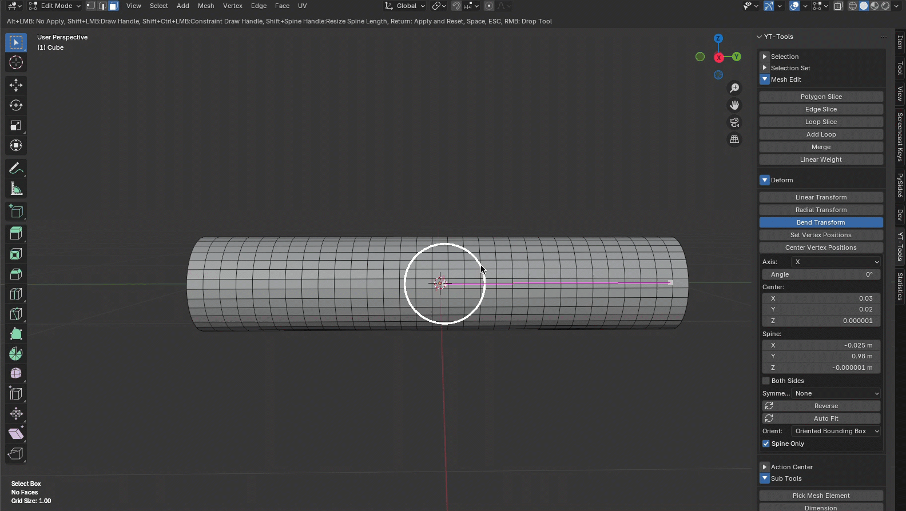
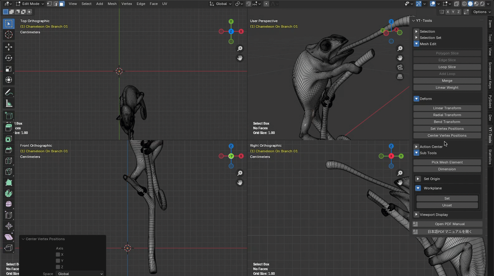

---
# Feel free to add content and custom Front Matter to this file.
# To modify the layout, see https://jekyllrb.com/docs/themes/#overriding-theme-defaults

layout: default
permalink: /yt-tools/
---
# YT-Tools for Blender v1.1 Release Note

## ✨ New Features Overview

### 🔹 Bend Tool
<b>Bend Transform</b> is a transformation tool similar to Modo's Bend tool. It bends the coordinate values of selected vertices around the spine handle of the bend. <b>Center</b> is the center position of the bend, from which the bend will occur. <b>Spine</b> is the vector along which the bend will occur. <b>Axis</b> defines the plane along which the bend will occur. You can set it to a major X/Y/Z axis or the current view direction. If you want to specify the direction of the selected element's normal vector, you can use WorkPlane feature. 

<b>Both Sides</b> also transforms the coordinates of vertices located in the opposite direction to the spine vector.  

### <ins>Set Vertex Positions</ins> 
<b>Set Vertex Positions</b> sets the coordinate values of the selected vertices to the specified values. <b>Axis</b> specifies the component of the coordinate value to be set; only the coordinate components of the enabled axes are updated. <b>Position</b> specifies the coordinate value to be set; the coordinate value of the active vertex is set as the default. If there is no active vertex, the center value of the selected vertex coordinates is set. <b>Space</b> specifies whether the coordinate values are set in local mesh coordinates or global object coordinates. <b>Mode</b> specifies whether the specified Position value replaces the existing vertex value (SET) or is added (ADD).  

### <ins>Center Vertex Positions</ins> 
<b>Center Vertex Positions</b> sets the coordinate values of the selected vertices to the center value of the bounding box containing the selected vertices. <b>Axis</b> is the component of the coordinate value to set; only the components of the coordinate value for the enabled axis will be updated. <b>Space</b> specifies whether the coordinate value is set in the mesh's local coordinate value or the object's global coordinate value. 

### <ins>Radial Transform Invert option</ins> 
<b>Invert</b> inverts falloff weight (w = 1.0 - w). 
