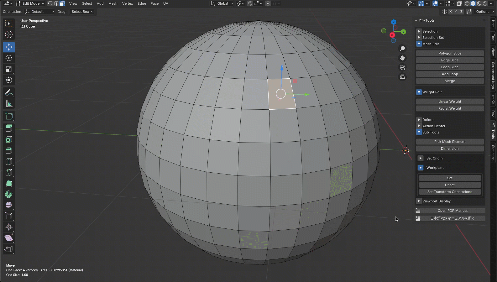
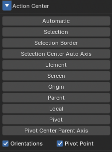

---
# Feel free to add content and custom Front Matter to this file.
# To modify the layout, see https://jekyllrb.com/docs/themes/#overriding-theme-defaults

layout: default
permalink: /yt-tools/release_1_2.html
---
# YT-Tools for Blender v1.2 Release Note

## ✨ New Features Overview

### 🔹 Radial Weight
<b>Radial Weight</b> is an operator that sets the weight used for the radial falloff. It sets the weight of vertices within the spherical area to the currently selected Vertex Group. If there is no active Vertex Group, a new Vertex Group will be created and the weight value will be added to it. <b>Weight</b> is the weight value to set, and <b>Replace</b> overwrites the existing weight value with the set weight. <b>Additive</b> and <b>Subtract</b> add or subtract new values ​​to the existing weight value. <b>Radial Center</b> and <b>Radial Side</b> are the center point and radius of the radial falloff sphere. The falloff weight is smaller the closer to the center point, and larger the movement is the farther away from the center. The weight is zero outside the sphere. These positions are set to fit the bounding box of the currently selected mesh element when the operator is launched. You can redraw the sphere by holding down the Shift key and dragging in the 3D view screen. Additionally, holding down the Ctrl key while dragging the LMB constrains the drag direction to horizontal or vertical. Holding down the Alt key while hauling delays the application of the weight value until you release the Alt key, allowing for faster mouse operation.  

### 🔹 Soft Drag
<b>Soft Drag</b> is a transformation tool that smoothly moves the coordinate values ​​of vertices within the radius specified by Size, centered on the point you click on the screen. <b>Size</b> is the radius of the falloff circle on the screen, which you can change interactively by holding down the Shift key and dragging the LMB. Clicking and dragging the LMB at the desired location will move vertices within the falloff circle.  

### 🔹 Workplane Update
<b>Set Transform Orientations</b> sets the construction plane rotation matrix to a named custom Transform Orientation. This is useful if you want to manipulate transformations in the perspective view rather than the planar view.

### 🔹 Action Center Update
If you want to specify the Pivot Point and Orientation separately, use the Pivot Point and Orientation toggle buttons. If the toggle button is off, the Pivot Point or Orientation will not be set.

