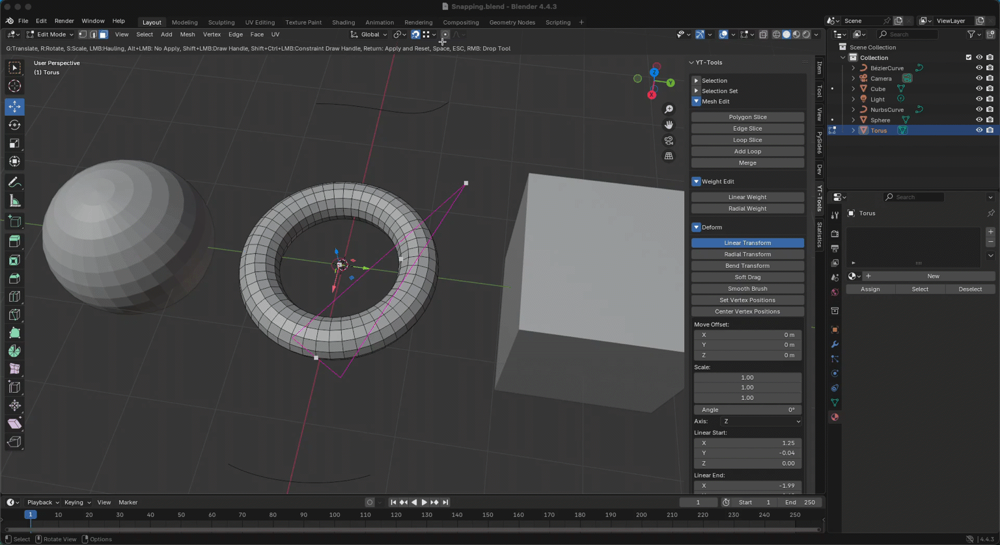

---
# Feel free to add content and custom Front Matter to this file.
# To modify the layout, see https://jekyllrb.com/docs/themes/#overriding-theme-defaults

layout: default
permalink: /yt-tools/release_1_4.html
---
# YT-Tools for Blender v1.4 Release Note

## ✨ New Features Overview

### 🔹 Snapping
Now interactive operator tool handles support snapping. They respect Blender's Snap on/off state and the following panel settings: 
- <ins>Snap Target</ins> 
Supports Increment, Grid, Vertex, Edge, Face, Edge Center, and Edge Perpendicular.Vertex snaps to mesh vertices and curve control points. 
- <ins>Target Selection</ins> 
When <b>Include Active</b> is off, snapping to elements of the active object is not supported. 
- <ins>Affect</ins> 
Supports Move, Rotate, and Scale. 
- <ins>Rotation Increment</ins> 
Refers to the standard incremental angle.  

### 🔹 Other Changes
- Fixed another issue so that Randomize Transform does not work with YT-Tools