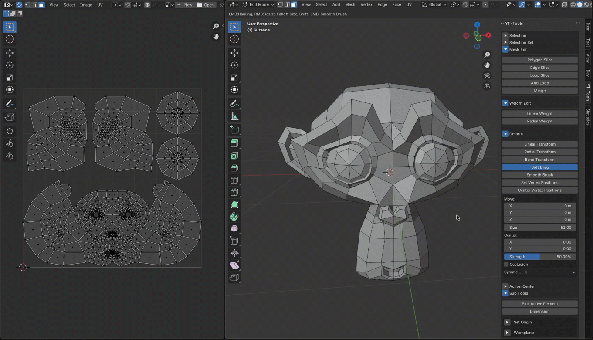
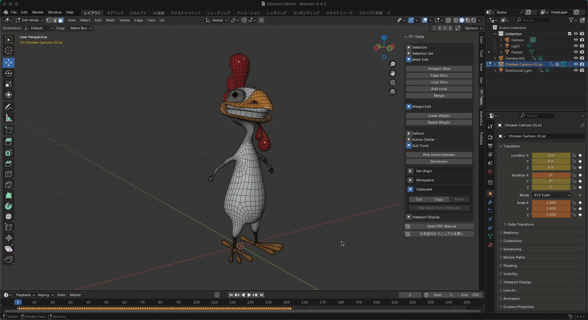

---
# Feel free to add content and custom Front Matter to this file.
# To modify the layout, see https://jekyllrb.com/docs/themes/#overriding-theme-defaults

layout: default
permalink: /yt-tools/release_1_5.html
---
# YT-Tools for Blender v1.5 Release Note

## ✨ New Features Overview

### 🔹 Soft Drag on UV view
<b>Soft Drag</b> allows you to edit not only mesh vertices but also UV map points. You can edit the UV map displayed in the UV editor using the same operations as in the 3D view. 

### 🔹 Clipboard
Sub Tools provide a clipboard for copying, cutting, and pasting mesh elements (vertices, edges, and faces). Select an element and press the Copy button to save it to the internal mesh on the clipboard. Saved elements can be pasted to the currently active mesh by pressing the Paste button. Pressing the Copy button without selecting anything copies all elements of the active mesh to the clipboard. The Cut button copies the mesh elements and then deletes the selected elements from the active mesh. When copying in vertex mode, only the mesh vertices are saved to the clipboard. In edge mode, only the edges that make up the mesh are copied like a wireframe.  
<b>New Mesh from Clipboard</b> pastes the data stored in the clipboard into a newly created mesh.  
The following attributes can also be copied and pasted on the clipboard:  
* Material
* UV Map, Vertex Color, Shapekey
* Edge Crease, Smooth, Seam, Freestyle
* Vertex Weight (Vertex Group)

