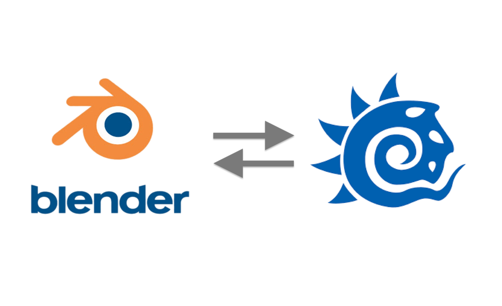
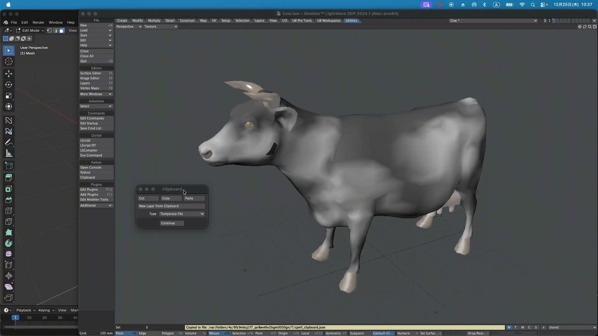

---
# Feel free to add content and custom Front Matter to this file.
# To modify the layout, see https://jekyllrb.com/docs/themes/#overriding-theme-defaults

layout: default
permalink: /yt-tools/release_1_7.html
---
# YT-Tools for Blender v1.7 Release Note

## ✨ New Features Overview

### 🔹 Absolute Scale
Absolute Scaling allows you to determine the dimensions of your mesh and then rescale it uniformly, explicitly or in reference to the dimensions of your mesh using precise numeral values. While it is possible to rescale a mesh item once it has been created, hauling the scale tool or adjusting the Scale X/Y/Z channels. 

### 🔹 FPS Gauge
Enabling the FPS gauge will display the 3D view drawing speed as a color gauge and in FPS (Frames Per Second).

### 🔹 External Clipboard Update
**External Clipboard** now supports copying and pasting multiple objects to the clipboard at once. The **ModoClipboard kit** is available from [Gumroad](https://tazaki.gumroad.com/) or [Github](https://github.com/tazee/ModoClipboard/releases) download site. Now **LightWave Clipboard** is available on [Gumroad](https://tazaki.gumroad.com/).

